# Java基础

## Java概念

### Java为什么是跨平台的？

Java 能支持跨平台，主要依赖于 JVM 关系比较大。

JVM也是一个软件，不同的平台有不同的版本。我们编写的Java源码，编译后会生成一种 .class 文件，称为字节码文件。Java虚拟机就是负责将字节码文件翻译成特定平台下的机器码然后运行。也就是说，只要在不同平台上安装对应的JVM，就可以运行字节码文件，运行我们编写的Java程序。

而这个过程中，我们编写的Java程序没有做任何改变，仅仅是通过JVM这一”中间层“，就能在不同平台上运行，真正实现了”一次编译，到处运行“的目的。

JVM是一个”桥梁“，是一个”中间件“，是实现跨平台的关键，Java代码首先被编译成字节码文件，再由JVM将字节码文件翻译成机器语言，从而达到运行Java程序的目的。

==编译的结果不是生成机器码，而是生成字节码==，字节码不能直接运行，必须通过JVM翻译成机器码才能运行。**不同平台下编译生成的字节码是一样的，但是由JVM翻译成的机器码却不一样。**

所以，运行Java程序必须有JVM的支持，因为编译的结果不是机器码，必须要经过JVM的再次翻译才能执行。即使你将Java程序打包成可执行文件（例如 .exe），仍然需要JVM的支持。

跨平台的是Java程序，不是JVM。==JVM是用C/C++开发的，是编译后的机器码，不能跨平台==，不同平台下需要安装不同版本的JVM。

### JVM JDK JRE 三者关系


- JVM是Java虚拟机，是Java程序运行的环境。它负责将Java字节码（由Java编译器生成）解释或编译成机器码，并执行程序。==JVM提供了内存管理、垃圾回收、安全性等功能==，使得Java程序具备跨平台性。
- JDK是Java开发工具包，是开发Java程序所需的工具集合。==它包含了JVM、编译器（javac）、调试器（jdb）等开发工具==，以及一系列的类库（如Java标准库和开发工具库）。JDK提供了开发、编译、调试和运行Java程序所需的全部工具和环境。
- JRE是Java运行时环境，是Java程序运行所需的最小环境。它==包含了JVM和一组Java类库==，用于支持Java程序的执行。==JRE不包含开发工具(编译器、调试器等 )==，只提供Java程序运行所需的运行环境。

### 为什么Java解释和编译都有

首先在Java经过编译之后生成字节码文件，接下来进入JVM中，就有两个步骤编译和解释。 如下图：


**编译性**：

- Java源代码首先被编译成字节码，JIT 会把编译过的机器码保存起来,以备下次使用。

**解释性：**

- JVM中一个方法调用计数器，当累计计数大于一定值的时候，就使用JIT进行编译生成机器码文件。否则就是用解释器进行解释执行，然后字节码也是经过解释器进行解释运行的。

> JVM 内部有一个 **方法调用计数器（Invocation Counter）**。
>
> - 每当某个方法被调用一次，这个计数器就 +1。
> - 当计数值超过一个阈值（HotSpot 默认大约 **10,000 次**，可配置），JVM 就认为这个方法是“热点方法”。

```
[解释执行]
   ↓
[计数器++] ——→ [计数器 < 阈值] → 继续解释执行
   ↓ 计数器 ≥ 阈值
[JIT 编译] → [生成机器码到Code Cache]
   ↓
[以后直接执行机器码]（更快）

```

##  数据类型


| 数据类型  | 占用大小（字节）              | 位数       | 取值范围                                                     | 默认值   | 描述                                                         |
| --------- | ----------------------------- | ---------- | ------------------------------------------------------------ | -------- | ------------------------------------------------------------ |
| `byte`    | 1                             | 8          | -128（-2^7） 到 127（2^7 - 1）                               | 0        | 是最小的整数类型，适合用于节省内存，例如在处理文件或网络流时存储小范围整数数据。 |
| `short`   | 2                             | 16         | -32768（-2^15） 到 32767（2^15 - 1）                         | 0        | 较少使用，通常用于在需要节省内存且数值范围在该区间的场景。   |
| `int`     | 4                             | 32         | -2147483648（-2^31） 到 2147483647（2^31 - 1）               | 0        | 最常用的整数类型，可满足大多数日常编程中整数计算的需求。     |
| `long`    | 8                             | 64         | -9223372036854775808（-2^63） 到 9223372036854775807（2^63 - 1） | 0L       | 用于表示非常大的整数，当 `int` 类型无法满足需求时使用，定义时数值后需加 `L` 或 `l`。 |
| `float`   | 4                             | 32         | 1.4E - 45 到 3.4028235E38                                    | 0.0f     | 单精度浮点数，用于表示小数，精度相对较低，定义时数值后需加 `F` 或 `f`。 |
| `double`  | 8                             | 64         | 4.9E - 324 到 1.7976931348623157E308                         | 0.0d     | 双精度浮点数，精度比 `float` 高，是 Java 中表示小数的默认类型。 |
| `char`    | 2                             | 16         | '\u0000'（0） 到 '\uffff'（65535）                           | '\u0000' | 用于表示单个字符，采用 Unicode 编码，可表示各种语言的字符。  |
| `boolean` | 无明确字节大小（理论上 1 位） | 无明确位数 | `true` 或 `false`                                            | `false`  | 用于逻辑判断，只有两个取值，常用于条件判断和循环控制等逻辑场景。 |


### 为什么要有Integer

1. 一个非常重要的原因就是在Java中绝大部分方法或类都是用来处理类类型对象的，如ArrayList集合类就只能以类作为他的存储对象，而这时如果想把一个int型的数据存入list是不可能的，必须把它包装成类，也就是Integer才能被List所接受。所以Integer的存在是很必要的 

2. 在Java中，基本类型和引用类型不能直接进行转换，必须使用包装类来实现。例如，将一个int类型的值转换为String类型，必须首先将其转换为Integer类型，然后再转换为String类型。

   *注：如果使用String.valueOf()并不需要经过Integer装箱 而是char数组转换*

### 为什么要保留int

1. int是一种基本数据类型，而Integer是一种引用类型。基本数据类型是Java中最基本的数据类型，它们是预定义的，不需要实例化就可以使用。而引用类型则需要通过实例化对象来使用。这意味着，使用int来存储一个整数时，不需要任何额外的内存分配，而使用Integer时，必须为对象分配内存。在性能方面，基本数据类型的操作通常比相应的引用类型快。

2. 包装类是引用类型，对象的引用和对象本身是分开存储的，而对于基本类型数据，变量对应的内存块直接存储数据本身。

   因此，基本类型数据在读写效率方面，要比包装类高效。除此之外，在64位JVM上，在开启引用压缩的情况下，一个Integer对象占用16个字节的内存空间，而一个int类型数据只占用4字节的内存空间，前者对空间的占用是后者的4倍。

   也就是说，不管是读写效率，还是存储效率，基本类型都比包装类高效。

### 缓存

Java的Integer类内部实现了一个静态缓存池，用于存储特定范围内的整数值对应的Integer对象。

默认情况下，这个范围是-128至127。当通过Integer.valueOf(int)方法创建一个在这个范围内的整数对象时，并不会每次都生成新的对象实例，而是复用缓存中的现有对象，会直接从内存中取出，不需要新建一个对象。

##  面向对象

###  Java面向对象的三大特性包括：**封装、继承、多态**：

- **封装**：封装是指将对象的属性（数据）和行为（方法）结合在一起，对外隐藏对象的内部细节，仅通过对象提供的接口与外界交互。封装的目的是增强安全性和简化编程，使得对象更加独立。
- **继承**：继承是一种可以使得子类自动共享父类数据结构和方法的机制。它是代码复用的重要手段，通过继承可以建立类与类之间的层次关系，使得结构更加清晰。
- **多态**：多态是指允许不同类的对象对同一消息作出响应。即同一个接口，使用不同的实例而执行不同操作。多态性可以分为编译时多态（重载）和运行时多态（重写）。它使得程序具有良好的灵活性和扩展性。

### 面向对象编程中的六大原则：

- **单一职责原则（SRP）**：一个类应该只有一个引起它变化的原因，即一个类应该==只负责一项职责==。例子：考虑一个员工类，它应该只负责管理员工信息，而不应负责其他无关工作。
- **开放封闭原则（OCP）**：软件实体应该==对扩展开放，对修改封闭==。例子：通过制定接口来实现这一原则，比如定义一个图形类，然后让不同类型的图形继承这个类，而不需要修改图形类本身。
- **里氏替换原则（LSP）**：子类对象应该能够==替换掉所有父类对象==。例子：一个正方形是一个矩形，但如果修改一个矩形的高度和宽度时，正方形的行为应该如何改变就是一个违反里氏替换原则的例子。==不能违反契约==
- **接口隔离原则（ISP）**：客户端不应该依赖那些它不需要的接口，即接口应该==小而专==。例子：通过接口抽象层来实现底层和高层模块之间的解耦，比如使用依赖注入。
- **依赖倒置原则（DIP）**：==高层模块不应该依赖低层模块==，二者都应该依赖于抽象；抽象不应该依赖于细节，细节应该依赖于抽象。例子：如果一个公司类包含部门类，应该考虑使用合成/聚合关系，而不是将公司类继承自部门类。
- **迪米特法则(Law of Demeter)**：一个对象应当对其他对象有最少的了解，只与其直接的朋友交互。

### Java抽象类和接口的区别是什么？

**两者的特点：**

- 抽象类用于描述类的共同特性和行为，==可以有成员变量、构造方法和具体方法==。适用于有明显继承关系的场景。
- 接口用于定义行为规范，可以多实现，==只能有常量和抽象方法（Java 8 以后可以有默认方法和静态方法）==。适用于定义类的能力或功能。

**两者的区别：**

- 实现方式：实现接口的关键字为implements，继承抽象类的关键字为extends。一个类可以实现多个接口，但一个类只能继承一个抽象类。所以，使用接口可以间接地实现多重继承。
- 方法方式：接口只有定义，不能有方法的实现，java 1.8中可以定义default方法体，而抽象类可以有定义与实现，方法可在抽象类中实现。
- 访问修饰符：==接口成员变量默认为public static final，必须赋初值，不能被修改==；其所有的成员方法都是==public、abstract==的。抽象类中成员变量默认default，可在子类中被重新定义，也可被重新赋值；抽象方法被abstract修饰，不能被private、static、synchronized和native等修饰，必须以分号结尾，不带花括号。
- 变量：抽象类可以包含实例变量和静态变量，而接口只能包含常量（即静态常量）。

### 接口里面可以定义哪些方法？

- **抽象方法**

抽象方法是接口的核心部分，所有实现接口的类都必须实现这些方法。抽象方法默认是 public 和 abstract，这些修饰符可以省略。

```java
public interface Animal {
    void makeSound();
}
```

- **默认方法**

默认方法是在 Java 8 中引入的，允许接口提供具体实现。实现类可以选择重写默认方法。

```java
public interface Animal {
    void makeSound();
    
    default void sleep() {
        System.out.println("Sleeping...");
    }
}
```

- **静态方法**

静态方法也是在 Java 8 中引入的，它们属于接口本身，可以通过接口名直接调用，而不需要实现类的对象。

```java
public interface Animal {
    void makeSound();
    
    static void staticMethod() {
        System.out.println("Static method in interface");
    }
}
```

- **私有方法**

私有方法是在 Java 9 中引入的，用于在接口中为默认方法或其他私有方法提供辅助功能。这些方法不能被实现类访问，只能在接口内部使用。

```java
public interface Animal {
    void makeSound();
    
    default void sleep() {
        System.out.println("Sleeping...");
        logSleep();
    }
    
    private void logSleep() {
        System.out.println("Logging sleep");
    }
}
public interface Animal {
    void makeSound();
}
```

==在接口中，不可以有构造方法,==在接口里写入构造方法时，编译器提示：Interfaces cannot have constructors，因为接口不会有自己的实例的，所以不需要有构造函数。 

#### 抽象类可以被实例化吗？

在Java中，抽象类本身不能被实例化。

这意味着不能使用`new`关键字直接创建一个抽象类的对象。抽象类的存在主要是为了被继承，它通常包含一个或多个抽象方法（由`abstract`关键字修饰且无方法体的方法），这些方法需要在子类中被实现。

==抽象类可以有构造器，这些构造器在子类实例化时会被调用==，以便进行必要的初始化工作。然而，这个过程并不是直接实例化抽象类，而是创建了子类的实例，间接地使用了抽象类的构造器。

```java
public abstract class AbstractClass {
    public AbstractClass() {
        // 构造器代码
    }
    
    public abstract void abstractMethod();
}

public class ConcreteClass extends AbstractClass {
    public ConcreteClass() {
        super(); // 调用抽象类的构造器
    }
    
    @Override
    public void abstractMethod() {
        // 实现抽象方法
    }
}

// 下面的代码可以运行
ConcreteClass obj = new ConcreteClass();
```

在这个例子中，`ConcreteClass`继承了`AbstractClass`并实现了抽象方法`abstractMethod()`。当我们创建`ConcreteClass`的实例时，`AbstractClass`的构造器被调用，但这并不意味着`AbstractClass`被实例化；实际上，我们创建的是`ConcreteClass`的一个对象。

简而言之，抽象类不能直接实例化，但通过继承抽象类并实现所有抽象方法的子类是可以被实例化的。

------

#### Java中的静态变量和静态方法

在Java中，静态变量和静态方法是与类本身关联的，而不是与类的实例（对象）关联。它们在内存中只存在一份，可以被类的所有实例共享。

- **共享性**：所有该类的实例共享同一个静态变量。如果一个实例修改了静态变量的值，其他实例也会看到这个更改。

- **初始化**：静态变量在类被加载时初始化，只会对其进行一次分配内存。

- **访问方式**：静态变量可以直接通过类名访问，也可以通过实例访问，但推荐使用类名。

- **无实例依赖**：静态方法可以在没有创建类实例的情况下调用。对于静态方法来说，==不能直接访问非静态的成员变量或方法，因为静态方法没有上下文的实例。==

- **访问静态成员**：静态方法可以直接调用其他静态变量和静态方法，但不能直接访问非静态成员。

- **多态性**：==静态方法不支持重写（Override），但可以被隐藏（Hide）==。

  ```java
  class Parent {
      static void hello() {
          System.out.println("Parent hello");
      }
  }
  
  class Child extends Parent {
      static void hello() {
          System.out.println("Child hello");
      }
  }
  
  public class Test {
      public static void main(String[] args) {
          Parent p = new Child();
          Parent.hello();  // 输出 Parent hello
          Child.hello();   // 输出 Child hello
          p.hello();       // 输出 Parent hello，因为 p 的类型是 Parent
      }
  }
  
  ```

------

#### 非静态内部类和静态内部类的区别？

- 非静态内部类==依赖于外部类的实例==，而静态内部类==不依赖于外部类的实例==。

- 非静态内部类可以==访问外部类的实例变量和方法==，而静态内部类只能访问外部类的==静态成员==。

- 非静态内部类不能定义静态成员，而静态内部类可以定义静态成员。

- 非静态内部类在外部类实例化后才能实例化，而静态内部类可以独立实例化。

- 非静态内部类==可以访问外部类的私有成员==，而静态内部类不能直接访问外部类的私有成员，需要通过实例化外部类来访问。

  ```java
  class Outer {
      private int x = 10;
      private static int y = 20;
  
      static class Inner {
          void print() {
              // System.out.println(x); // ❌ 错误，不能直接访问实例成员
              Outer outer = new Outer();       // 先创建外部类实例
              System.out.println(outer.x);     // ✅ 通过外部类对象访问
  
              System.out.println(Outer.y);     // ✅ 可以直接访问静态成员
          }
      }
  }
  
  public class Test {
      public static void main(String[] args) {
          Outer.Inner inner = new Outer.Inner();
          inner.print();
      }
  }
  
  ```

------

#### 非静态内部类可以直接访问外部方法，编译器是怎么做到的？

非静态内部类可以直接访问外部方法是因为编译器在生成字节码时会为非静态内部类==维护一个指向外部类实例的引用==。

这个引用使得非静态内部类能够访问外部类的实例变量和方法。编译器会在生成非静态内部类的构造方法时，将外部类实例作为参数传入，并在内部类的实例化过程中建立外部类实例与内部类实例之间的联系，从而实现直接访问外部方法的功能。

------

## 深拷贝

==实现深拷贝三种方式是什么？==

### 1. 实现 Cloneable 接口并重写 clone() 方法

这种方法要求对象及其所有引用类型字段都实现 Cloneable 接口，并且重写 clone() 方法。在 clone() 方法中，通过递归克隆引用类型字段来实现深拷贝。

```java
class MyClass implements Cloneable {
    private String field1;
    private NestedClass nestedObject;

    @Override
    protected Object clone() throws CloneNotSupportedException {
        MyClass cloned = (MyClass) super.clone();
        cloned.nestedObject = (NestedClass) nestedObject.clone(); // 深拷贝内部的引用对象
        return cloned;
    }
}

class NestedClass implements Cloneable {
    private int nestedField;

    @Override
    protected Object clone() throws CloneNotSupportedException {
        return super.clone();
    }
}
```

### 2. 使用序列化和反序列化

通过将对象序列化为字节流，再从字节流反序列化为对象来实现深拷贝。要求对象及其所有引用类型字段都实现 Serializable 接口。

```java
import java.io.*;

class MyClass implements Serializable {
    private String field1;
    private NestedClass nestedObject;

    public MyClass deepCopy() {
        try {
            ByteArrayOutputStream bos = new ByteArrayOutputStream();
            ObjectOutputStream oos = new ObjectOutputStream(bos);
            oos.writeObject(this);
            oos.flush();
            oos.close();

            ByteArrayInputStream bis = new ByteArrayInputStream(bos.toByteArray());
            ObjectInputStream ois = new ObjectInputStream(bis);
            return (MyClass) ois.readObject();
        } catch (IOException | ClassNotFoundException e) {
            e.printStackTrace();
            return null;
        }
    }
}

class NestedClass implements Serializable {
    private int nestedField;
}
```

### 3. 手动递归复制

针对特定对象结构，手动递归复制对象及其引用类型字段。适用于对象结构复杂度不高的情况。

```java
class MyClass {
    private String field1;
    private NestedClass nestedObject;

    public MyClass deepCopy() {
        MyClass copy = new MyClass();
        copy.setField1(this.field1);
        copy.setNestedObject(this.nestedObject.deepCopy());
        return copy;
    }
}

class NestedClass {
    private int nestedField;

    public NestedClass deepCopy() {
        NestedClass copy = new NestedClass();
        copy.setNestedField(this.nestedField);
        return copy;
    }
}
```

## 对象

### 创建对象的方式有哪些？

**使用new关键字**：通过new关键字直接调用类的构造方法来创建对象。

```java
MyClass obj = new MyClass();
```

**使用Class类的newInstance()方法**：通过反射机制，可以使用Class类的newInstance()方法创建对象。

```java
MyClass obj = (MyClass) Class.forName("com.example.MyClass").newInstance();
```

**使用Constructor类的newInstance()方法**：同样是通过反射机制，可以使用Constructor类的newInstance()方法创建对象。

```java
Constructor<MyClass> constructor = MyClass.class.getConstructor();
MyClass obj = constructor.newInstance();
```

**使用clone()方法**：如果类实现了Cloneable接口，可以使用clone()方法复制对象。

```java
MyClass obj1 = new MyClass();
MyClass obj2 = (MyClass) obj1.clone();
```

**使用反序列化**：通过将对象序列化到文件或流中，然后再进行反序列化来创建对象。

```java
// SerializedObject.java
ObjectOutputStream out = new ObjectOutputStream(new FileOutputStream("object.ser"));
out.writeObject(obj);
out.close();

// DeserializedObject.java
ObjectInputStream in = new ObjectInputStream(new FileInputStream("object.ser"));
MyClass obj = (MyClass) in.readObject();
in.close();
```

------

### new出来的对象什么时候回收？

通过过关键字`new`创建的对象，由Java的垃圾回收器（Garbage Collector）负责回收。垃圾回收器的工作是在程序运行过程中自动进行的，它会周期性地检测不再被引用的对象，并将其回收释放内存。

具体来说，Java对象的回收时机是由垃圾回收器根据一些算法来决定的，主要有以下几种情况：

1. **引用计数法：**某个对象的引用计数为0时，表示该对象不再被引用，可以被回收。
2. **可达性分析算法：**从根对象（如方法区中的类静态属性、方法中的局部变量等）出发，通过对象之间的引用链进行遍历，如果存在一条引用链到达某个对象，则说明该对象是可达的，反之不可达，不可达的对象将被回收。
3. **终结器（Finalizer）：**如果对象重写了`finalize()`方法，垃圾回收器会在回收该对象之前调用`finalize()`方法，对象可以在`finalize()`方法中进行一些清理操作。然而，终结器机制的使用不被推荐，因为它的执行时间是不确定的，可能会导致不可预测的性能问题。

------

### 如何获取私有对象？

1. 使用公共访问器方法（getter 方法）：如果类的设计者遵循良好的编程规范，通常会为私有成员变量提供公共的访问器方法（即 `getter` 方法），通过调用这些方法可以安全地获取私有对象

2. 反射机制。反射机制允许在运行时检查和修改类、方法、字段等信息，通过反射可以绕过 `private` 访问修饰符的限制来获取私有对象

   ```java
   import java.lang.reflect.Field;
   
   class MyClass {
       private String privateField = "私有字段的值";
   }
   
   public class Main {
       public static void main(String[] args) throws NoSuchFieldException, IllegalAccessException {
           MyClass obj = new MyClass();
           // 获取 Class 对象
           Class<?> clazz = obj.getClass();
           // 获取私有字段
           Field privateField = clazz.getDeclaredField("privateField");
           // 设置可访问性
           privateField.setAccessible(true);
           // 获取私有字段的值
           String value = (String) privateField.get(obj);
           System.out.println(value); 
       }
   }
   ```

------

## 反射

Java 反射机制是在运行状态中，对于任意一个类，都能够知道这个类中的所有属性和方法，对于任意一个对象，都能够调用它的任意一个方法和属性；这种动态获取的信息以及动态调用对象的方法的功能称为 Java 语言的反射机制。

反射具有以下特性：

1. **运行时类信息访问**：反射机制允许程序在运行时获取类的==完整结构信息==，包括类名、包名、父类、实现的接口、构造函数、方法和字段等。
2. **动态对象创建**：可以使用反射API动态地创建对象实例，即使在编译时不知道具体的类名。这是通过Class类的==newInstance()方法==或Constructor对象的newInstance()方法实现的。
3. **动态方法调用**：可以在运行时动态地==调用对象的方法==，包括私有方法。这通过==Method类的invoke()方法==实现，允许你传入对象实例和参数值来执行方法。
4. **访问和修改字段值**：反射还允许程序在运行时访问和修改对象的字段值，即使是私有的。这是通过==Field类的get()和set()方法==完成的。

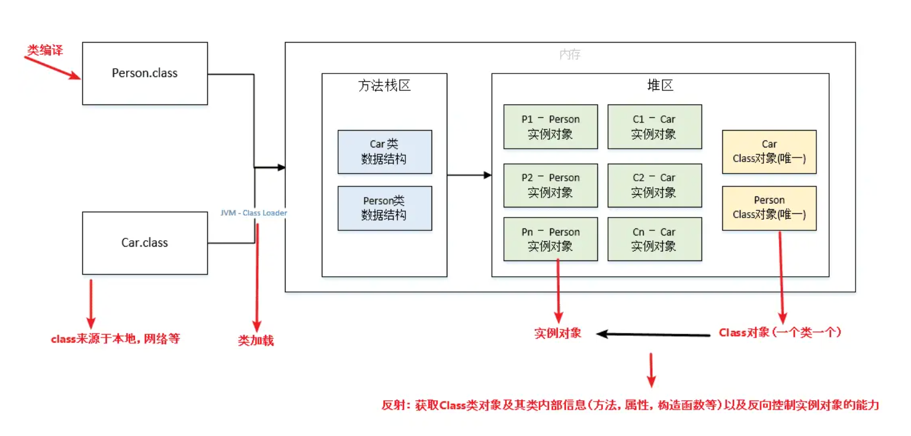

==为什么反射机制能获取类或对象所有信息 怎么做到的==

- 编译后的字节码保留了完整类元信息。

- JVM 在运行时加载类并保存元数据。

- `java.lang.reflect` API 提供了访问这些元数据的能力。

- JVM 内部可以访问内存对象，所以可以读/写字段和调用方法。

==那为什么c++不能有这种反射机制==

### 1️⃣ 编译时 vs 运行时

- **C++** 是静态编译语言，类型信息在编译阶段就确定了，编译器会将类、方法和字段的元信息直接编译进二进制代码，但不会保留完整的字段名、方法名、类型信息等元数据。
- **Java** 是半动态语言，编译后的字节码保留了完整的类元数据，JVM 可以在运行时访问这些信息。

**结论**：C++ 编译后的程序为了效率和体积，不保留足够的元信息，运行时无法像 Java 那样“问类它有啥字段/方法”。

### 2️⃣ 内存布局不同

- C++ 对象在内存中是紧凑布局的，字段的名字和类型信息只在编译器内部使用，不存储在运行时内存中。
- Java 对象在 JVM 堆中有对象头，类的元数据在方法区/元空间中保存，因此可以通过指针找到字段、方法信息。

| 特性         | C++                  | Java                      |
| ------------ | -------------------- | ------------------------- |
| 对象内存位置 | 栈/堆/全局区，OS管理 | JVM堆，JVM管理            |
| 内存布局     | 编译期固定           | JVM运行期可查询元数据     |
| 字段名信息   | 编译期存在，运行期无 | 运行期存在于元数据中      |
| 执行方式     | 本地机器码           | 字节码 → JVM解释或JIT编译 |

------

## 注解

注解解析的底层实现主要依赖于 Java 的反射机制和字节码文件的存储。通过 `@Retention` 元注解可以控制注解的保留策略，当使用 `RetentionPolicy.RUNTIME` 时，可以在运行时通过反射 API 来解析注解信息。在 JVM 层面，会从字节码文件中读取注解信息，并创建注解的代理对象来获取注解的属性值。


注解本质是一个继承了Annotation的特殊接口，其具体实现类是Java运行时生成的动态代理类。

我们通过反射获取注解时，返回的是Java运行时生成的动态代理对象。通过代理对象调用自定义注解的方法，会最终调用AnnotationInvocationHandler的invoke方法。该方法会从memberValues这个Map中索引出对应的值。而memberValues的来源是Java常量池。

在 **Java 反射机制**里，`invoke` 的作用就是 **在运行时调用某个方法**，不管你在编译时是否知道方法具体是谁

------

## 异常

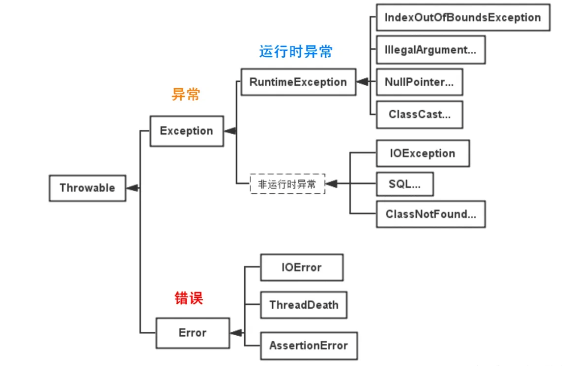

Java的异常体系主要基于两大类：Throwable类及其子类。Throwable有两个重要的子类：Error和Exception，它们分别代表了不同类型的异常情况。

1. **Error（错误）**：表示运行时环境的错误。错误是程序无法处理的严重问题，如系统崩溃、虚拟机错误、动态链接失败等。通常，程序不应该尝试捕获这类错误。例如，OutOfMemoryError、StackOverflowError等。
2. **Exception（异常）**：表示程序本身可以处理的异常条件。异常分为两大类：
   - **非运行时异常**：这类异常在编译时期就必须被捕获或者声明抛出。它们通常是外部错误，如文件不存在（FileNotFoundException）、类未找到（ClassNotFoundException）等。非运行时异常强制程序员处理这些可能出现的问题，增强了程序的健壮性。
   - **运行时异常**：这类异常包括运行时异常（RuntimeException）和错误（Error）。运行时异常由程序错误导致，如空指针访问（NullPointerException）、数组越界（ArrayIndexOutOfBoundsException）等。运行时异常是不需要在编译时强制捕获或声明的。

**抛出异常为什么不用throws？**

如果异常是未检查异常或者在方法内部被捕获和处理了，那么就不需要使用throws。

- **Unchecked Exceptions**：未检查异常（unchecked exceptions）是继承自RuntimeException类或Error类的异常，编译器不强制要求进行异常处理。因此，对于这些异常，不需要在方法签名中使用throws来声明。示例包括NullPointerException、ArrayIndexOutOfBoundsException等。
- **捕获和处理异常**：另一种常见情况是，在方法内部捕获了可能抛出的异常，并在方法内部处理它们，而不是通过throws子句将它们传递到调用者。这种情况下，方法可以处理异常而无需在方法签名中使用throws。

**try catch中的语句运行情况**

try块中的代码将按顺序执行，如果抛出异常，将在catch块中进行匹配和处理，然后程序将继续执行catch块之后的代码。如果没有匹配的catch块，异常将被传递给上一层调用的方法。

**try{return “a”} fianlly{return “b”}这条语句返回啥**

finally块中的return语句会覆盖try块中的return返回，因此，该语句将返回"b"。

------

## Object

### hashcode和equals方法有什么关系？

在 Java 中，对于重写 `equals` 方法的类，通常也需要重写 `hashCode` 方法，并且需要遵循以下规定：

- **一致性**：如果两个对象使用 `equals` 方法比较结果为 `true`，那么它们的 `hashCode` 值必须相同。也就是说，如果 `obj1.equals(obj2)` 返回 `true`，那么 `obj1.hashCode()` 必须等于 `obj2.hashCode()`。
- **非一致性**：如果两个对象的 `hashCode` 值相同，它们使用 `equals` 方法比较的结果不一定为 `true`。即 `obj1.hashCode() == obj2.hashCode()` 时，`obj1.equals(obj2)` 可能为 `false`，这种情况称为哈希冲突。

`hashCode` 和 `equals` 方法是紧密相关的，重写 `equals` 方法时必须重写 `hashCode` 方法，以保证在使用哈希表等数据结构时，对象的相等性判断和存储查找操作能够正常工作。而重写 `hashCode` 方法时，需要确保相等的对象具有相同的哈希码，但相同哈希码的对象不一定相等

哈希表查找对象的流程是这样的：

1. 先调用对象的 `hashCode()` 算出哈希值，定位到某个桶（bucket）。
2. 再在这个桶里用 `equals()` 判断是否“真正相等”。

==👉 所以 `hashCode` 决定 **去哪个桶**，`equals` 决定 **桶里比对是否相等**。==

### String、StringBuffer、StringBuilder的区别和联系

**1、可变性** ：`String` 是不可变的（Immutable），一旦创建，内容无法修改，每次修改都会生成一个新的对象。`StringBuilder` 和 `StringBuffer` 是可变的（Mutable），可以直接对字符串内容进行修改而不会创建新对象。

**2、线程安全性** ：`String` 因为不可变，天然线程安全。`StringBuilder` 不是线程安全的，适用于单线程环境。`StringBuffer` 是线程安全的，其方法通过 `synchronized` 关键字实现同步，适用于多线程环境。

**3、性能** ：`String` 性能最低，尤其是在频繁修改字符串时会生成大量临时对象，增加内存开销和垃圾回收压力。`StringBuilder` 性能最高，因为它没有线程安全的开销，适合单线程下的字符串操作。`StringBuffer` 性能略低于 `StringBuilder`，因为它的线程安全机制引入了同步开销。

**4、使用场景** ：如果字符串内容固定或不常变化，优先使用 `String`。如果需要频繁修改字符串且在单线程环境下，使用 `StringBuilder`。如果需要频繁修改字符串且在多线程环境下，使用 `StringBuffer`。

对比总结如下：

| **特性**     | **String**       | **StringBuilder** | **StringBuffer** |
| ------------ | ---------------- | ----------------- | ---------------- |
| **不可变性** | 不可变           | 可变              | 可变             |
| **线程安全** | 是（因不可变）   | 否                | 是（同步方法）   |
| **性能**     | 低（频繁修改时） | 高（单线程）      | 中（多线程安全） |
| **适用场景** | 静态字符串       | 单线程动态字符串  | 多线程动态字符串 |

**StringBuilder线程不安全例子**

```java
public class StringBuilderTest {
    public static void main(String[] args) throws InterruptedException {
        StringBuilder sb = new StringBuilder();

        Runnable task = () -> {
            for (int i = 0; i < 1000; i++) {
                sb.append("a");
            }
        };

        Thread t1 = new Thread(task);
        Thread t2 = new Thread(task);

        t1.start();
        t2.start();
        t1.join();//表示：当前线程要等 t1 执行完才继续往下走。
        t2.join();//表示：当前线程要等 t2 执行完才继续往下走。

        // 预期：2000 个 'a'
        System.out.println("最终长度: " + sb.length());
    }
}

```

```
最终长度: 1789
```

**String相关**

✅ 直接赋值（字面量方式）

```
String s1 = "hello";
```

- 编译器在编译时就会把 `"hello"` 放入 **字符串常量池**（方法区/元空间中专门的一块区域）。
- 执行时，JVM 先在常量池里找 `"hello"`：
  - 如果存在 → 直接返回引用。
  - 如果不存在 → 新建并放入常量池。
- 所以 **不会在堆中新建对象**，直接用常量池里的。

👉 所以这句只会有 **常量池里的一个对象**。

------

✅ 使用 `new` 关键字

```
String s2 = new String("hello");
```

执行流程是：

1. `"hello"` 这个字面量先去常量池找，如果常量池没有，则放进去。
2. `new` 关键字会 **在堆里再创建一个新的对象**，内容和常量池的 `"hello"` 一样。
3. `s2` 引用指向的是堆中的这个新对象。

👉 所以这句通常会有 **两个对象**：常量池中的 `"hello"` + 堆中的新建对象。

------

## Java新特性

| **特性名称**                 | **描述**                                                     | **示例或说明**                                               |
| ---------------------------- | ------------------------------------------------------------ | ------------------------------------------------------------ |
| **Lambda 表达式**            | 简化匿名内部类，支持函数式编程                               | `(a, b) -> a + b` 代替匿名类实现接口                         |
| **函数式接口**               | 仅含一个抽象方法的接口，可用 `@FunctionalInterface` 注解标记 | `Runnable`, `Comparator`, 或自定义接口 `@FunctionalInterface interface MyFunc { void run(); }` |
| **Stream API**               | 提供链式操作处理集合数据，支持并行处理                       | `list.stream().filter(x -> x > 0).collect(Collectors.toList())` |
| **Optional 类**              | 封装可能为 `null` 的对象，减少空指针异常                     | `Optional.ofNullable(value).orElse("default")`               |
| **方法引用**                 | 简化 Lambda 表达式，直接引用现有方法                         | `System.out::println` 等价于 `x -> System.out.println(x)`    |
| **接口的默认方法与静态方法** | 接口可定义默认实现和静态方法，增强扩展性                     | `interface A { default void print() { System.out.println("默认方法"); } }` |
| **并行数组排序**             | 使用多线程加速数组排序                                       | `Arrays.parallelSort(array)`                                 |
| **重复注解**                 | 允许同一位置多次使用相同注解                                 | `@Repeatable` 注解配合容器注解使用                           |
| **类型注解**                 | 注解可应用于更多位置（如泛型、异常等）                       | `List<@NonNull String> list`                                 |
| **CompletableFuture**        | 增强异步编程能力，支持链式调用和组合操作                     | `CompletableFuture.supplyAsync(() -> "result").thenAccept(System.out::println)` |

------

### Lambda 表达式了解吗？

Lambda 表达式它是一种简洁的语法，用于创建匿名函数，主要用于简化函数式接口（只有一个抽象方法的接口）的使用。其基本语法有以下两种形式：

- `(parameters) -> expression`：当 Lambda 体==只有一个表达式时==使用，表达式的结果会作为返回值。
- `(parameters) -> { statements; }`：当 Lambda 体==包含多条语句时==，需要使用大括号将语句括起来，若有返回值则需要使用 `return` 语句。

传统的匿名内部类实现方式代码较为冗长，而 Lambda 表达式可以用更简洁的语法实现相同的功能。比如，使用==匿名内部类实现 `Runnable` 接口==

------

### Stream流的并行API是什么？

是 ==ParallelStream==。

并行流（ParallelStream）就是将源数据==分为多个子流对象进行多线程操作，然后将处理的结果再汇总为一个流对象==，底层是使用通用的 ==fork/join 池==来实现，即将一个任务拆分成多个“小任务”并行计算，再把多个“小任务”的结果合并成总的计算结果

Stream串行流与并行流的主要区别：

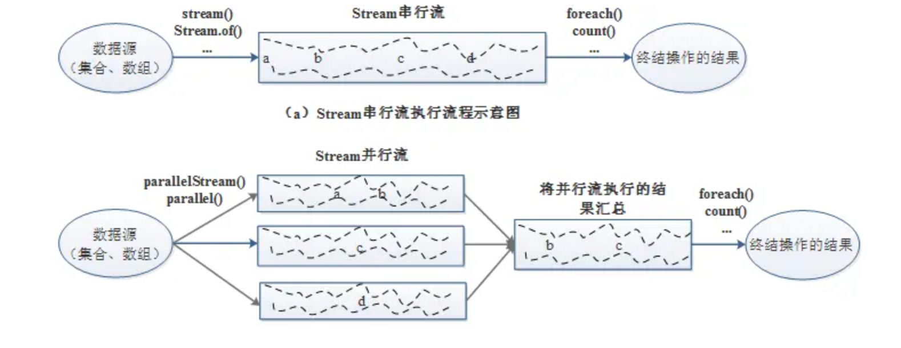

在 `ParallelStream` 里，JDK 解决并发问题 **主要靠“分而治之（任务拆分）”+“避免共享状态”**

**直接用 `parallelStream()`**

```java
List<String> list = Arrays.asList("a", "b", "c", "d", "e");

// 转换成并行流
list.parallelStream()
    .forEach(s -> System.out.println(Thread.currentThread().getName() + " -> " + s));

//输出示例
ForkJoinPool.commonPool-worker-3 -> a
main -> b
ForkJoinPool.commonPool-worker-5 -> c
ForkJoinPool.commonPool-worker-7 -> d
...

```

**普通 stream 转并行**

```java
list.stream()
    .parallel()
    .forEach(System.out::println);

```

**并行流转普通流**

```java
List<Integer> list = Arrays.asList(1, 2, 3, 4, 5);

list.parallelStream()        // 得到并行流
    .map(i -> i * i)
    .sequential()            // 转换为普通串行流
    .forEach(System.out::println);

```

------

### completableFuture怎么用的？

CompletableFuture是由Java 8引入的，在Java8之前我们一般通过Future实现异步。

**Future实现异步：** ==阻塞== 

```java
import java.util.concurrent.*;

public class FutureDemo {
    public static void main(String[] args) throws Exception {
        ExecutorService executor = Executors.newSingleThreadExecutor();

        // 提交一个异步任务，返回 Future
        Future<Integer> future = executor.submit(() -> {
            System.out.println("任务开始执行...");
            Thread.sleep(2000);  // 模拟耗时
            return 42;
        });

        System.out.println("主线程继续执行其他逻辑...");

        // 阻塞等待结果（任务没完成就会阻塞在这里）
        Integer result = future.get();

        System.out.println("异步任务结果：" + result);

        executor.shutdown();
    }
}

//结果
主线程继续执行其他逻辑...
任务开始执行...
异步任务结果：42

```

**CompletableFuture：** ==非阻塞回调==

```java
import java.util.concurrent.*;

public class CompletableFutureDemo {
    public static void main(String[] args) throws Exception {
        CompletableFuture<Integer> cf = CompletableFuture.supplyAsync(() -> {
            System.out.println("任务开始执行...");
            try { Thread.sleep(2000); } catch (InterruptedException e) {}
            return 42;
        });

        // 非阻塞回调，结果出来后自动触发
        cf.thenAccept(result -> {
            System.out.println("异步任务结果：" + result);
        });

        System.out.println("主线程继续执行，不阻塞...");
        
        Thread.sleep(3000); // 等一下，防止主线程过早结束
    }
}

//输出结果
主线程继续执行，不阻塞...
任务开始执行...
异步任务结果：42

```

==但get/join方法其实也是阻塞的  CompletableFuture通过异步回调实现非阻塞==

```
[ CompletableFuture 容器 ]
        |
        |-- 状态: 未完成 --> 阻塞 get/join
        |-- 状态: 完成(值) --> get() 返回这个值
        |-- 状态: 异常 --> get() 抛异常

```

#### 回调地狱

“回调地狱”并不是说程序**卡住、阻塞**，它跟线程阻塞没关系。

它的本质是：

- **代码嵌套太深** → 逻辑层层套，每增加一个异步操作就右移一层
- **可读性差、难维护** → 异常处理、调试都变麻烦
- **容易出错** → 嵌套过多可能忘记处理某些分支或异常

**回调地狱**

```java
CompletableFuture.supplyAsync(() -> task1()).thenAccept(result1 -> {
    CompletableFuture.supplyAsync(() -> task2(result1)).thenAccept(result2 -> {
        CompletableFuture.supplyAsync(() -> task3(result2)).thenAccept(result3 -> {
            CompletableFuture.supplyAsync(() -> task4(result3)).thenAccept(result4 -> {
                System.out.println(result4);
            });
        });
    });
});

```

**链式编程**

```java
CompletableFuture.supplyAsync(() -> task1())
    .thenApply(result1 -> task2(result1))
    .thenApply(result2 -> task3(result2))
    .thenApply(result3 -> task4(result3))
    .thenAccept(finalResult -> System.out.println(finalResult));

```

------

### Java 21 新特性知道哪些？

**新新语言特性：**

- **Switch 语句的模式匹配**：该功能在 Java 21 中也得到了增强。它允许在`switch`的`case`标签中使用模式匹配，使操作更加灵活和类型安全，减少了样板代码和潜在错误。

  ```java
  switch (obj) {
      case String s && s.length() > 3 -> System.out.println("长字符串: " + s);
      case String s -> System.out.println("短字符串: " + s);
      case Integer i -> System.out.println("整数: " + i);
      default -> System.out.println("其它类型");
  }
  ```

  

- **数组模式**：将模式匹配扩展到数组中，使开发者能够在条件语句中更高效地解构和检查数组内容。例如，`if (arr instanceof int[] {1, 2, 3})`，可以直接判断数组`arr`是否匹配指定的模式。

  ```java
  //传统写法
  int[] arr = {1, 2, 3};
  if (arr.length == 3 && arr[0] == 1 && arr[1] == 2 && arr[2] == 3) {
      System.out.println("数组匹配 [1,2,3]");
  }
  
  ```

- **字符串模板（预览版）**：提供了一种更可读、更易维护的方式来构建复杂字符串，支持在字符串字面量中直接嵌入表达式。例如，以前可能需要使用`"hello " + name + ", welcome to the geeksforgeeks!"`这样的方式来拼接字符串，在 Java 21 中可以使用`hello {name}, welcome to the geeksforgeeks!`这种更简洁的写法

**新并发特性方面：**

- **虚拟线程**：这是 Java 21 引入的一种轻量级并发的新选择。它通过共享堆栈的方式，大大降低了内存消耗，同时提高了应用程序的吞吐量和响应速度。可以使用静态构建方法、构建器或`ExecutorService`来创建和使用虚拟线程。
- **Scoped Values（范围值）**：提供了一种在线程间共享不可变数据的新方式，避免使用传统的线程局部存储，促进了更好的封装性和线程安全，可用于在不通过方法参数传递的情况下，传递上下文信息，如用户会话或配置设置。

------

## 序列化

### 怎么把一个对象从一个jvm转移到另一个jvm?

- **使用序列化和反序列化**：将对象序列化为字节流，并将其==发送到另一个 JVM==，然后在另一个 JVM 中反序列化字节流恢复对象。这可以通过 Java 的 ObjectOutputStream 和 ObjectInputStream 来实现。
- **使用消息传递机制**：利用消息传递机制，比如使用消息队列（如 ==RabbitMQ、Kafka==）或者通过网络套接字进行通信，将对象从一个 JVM 发送到另一个。这需要==自定义协议来序列化对象==并在另一个 JVM 中反序列化。
- **使用远程方法调用（RPC）**：可以使用远程方法调用框架，如 gRPC，来实现对象在不同 JVM 之间的传输。远程方法调用可以让你在分布式系统中调用远程 JVM 上的对象的方法。
- **使用共享数据库或缓存**：将对象存储在==共====享数据库==（如 MySQL、PostgreSQL）或==共享缓存==（如 Redis）中，让不同的 JVM 可以访问这些共享数据。这种方法适用于需要共享数据但不需要直接传输对象的场景。

------

### Java序列化存在什么问题？

- ==无法跨语言==： Java 序列化目前只适用基于 Java 语言实现的框架，其它语言大部分都没有使用 Java 的序列化框架，也没有实现 Java 序列化这套协议。因此，如果是两个基于不同语言编写的应用程序相互通信，则无法实现两个应用服务之间传输对象的序列化与反序列化。

- 容易被攻击：Java 序列化是不安全的，我们知道对象是通过在 ObjectInputStream 上调用 readObject() 方法进行反序列化的，这个方法其实是一个神奇的构造器，它可以将类路径上几乎所有实现了 Serializable 接口的对象都实例化。这也就意味着，在反序列化字节流的过程中，该方法可以执行任意类型的代码，这是非常危险的。

  ```java
  // 假设有恶意类
  class Evil implements Serializable {
      private void readObject(ObjectInputStream in) throws Exception {
          Runtime.getRuntime().exec("calc.exe"); // Windows 打开计算器
      }
  }
  
  // 攻击者构造 Evil 的字节流发送给服务器
  ObjectInputStream ois = new ObjectInputStream(inputStream);
  Object obj = ois.readObject(); // 触发了恶意代码
  
  ```

  ==jvm反序列化时看到readObject都会执行==

- ==序列化后的流太大==：序列化后的二进制流大小能体现序列化的性能。序列化后的二进制数组越大，占用的存储空间就越多，存储硬件的成本就越高。如果我们是进行网络传输，则占用的带宽就更多，这时就会影响到系统的吞吐量。

**考虑用主流序列化框架，比如FastJson、Protobuf来替代Java 序列化。**

| 维度     | JDK 原生           | JSON（FastJSON）       | 二进制 RPC（Hessian/Protobuf） |
| -------- | ------------------ | ---------------------- | ------------------------------ |
| 流大小   | 包含类元数据，较大 | 字段少，简单对象可能小 | 字段顺序固定，无字段名，最紧凑 |
| 可读性   | 不可读             | 可读                   | 不可读                         |
| 解析性能 | 中等               | 较快（轻量对象）       | 很快（轻量+直接内存映射）      |
| 安全性   | 不安全             | 安全                   | 安全（不自动调用构造器/方法）  |

------

### 将对象转为二进制字节流具体怎么实现?

只有实现了==Serializable==或==Externalizable==接口的类的对象才能被序列化，否则抛出异常！

1️⃣ **不加 serialVersionUID（自动生成）**

- JVM 会根据类的结构（字段、方法、继承关系等）计算一个 **hash 值** 作为序列化版本号
- **特点**：
  1. 类的每次修改都有可能改变自动生成的值
  2. 序列化的数据只能和 **完全相同版本的类** 反序列化

示例

```
public class User implements Serializable {
    private String name;
    private int age;
}
```

- 自动生成 serialVersionUID，比如 `1234567890L`
- 你序列化一个对象到文件，然后修改类：

```
public class User implements Serializable {
    private String name;
    private int age;
    private String email; // 新增字段
}
```

- JVM 自动生成的 serialVersionUID 变了，比如 `987654321L`
- 尝试反序列化旧数据 → 抛出：

```
java.io.InvalidClassException: User; local class incompatible
```

> 问题：哪怕只是加了一个字段，也会导致反序列化失败

------

2️⃣ **加上 serialVersionUID（手动指定）**

```
public class User implements Serializable {
    private static final long serialVersionUID = 1L;
    private String name;
    private int age;
}
```

- 无论类怎么修改（只要不破坏字段类型和逻辑），serialVersionUID 都不变
- 反序列化旧数据时，JVM 会认为版本一致 → 可以反序列化
- 新增字段会使用 **默认值**（null、0、false 等）

示例

```
public class User implements Serializable {
    private static final long serialVersionUID = 1L;
    private String name;
    private int age;
    private String email; // 新增字段
}
```

- 旧数据依然可以反序列化
- `email` 字段值为 null

---

##### 二进制写入/读取文件

1.实现对象序列化：

- 让类实现Serializable接口：

```java
import java.io.Serializable;

public class MyClass implements Serializable {
    // class code
}
```

- 创建输出流并写入对象：

```java
import java.io.FileOutputStream;
import java.io.ObjectOutputStream;

MyClass obj = new MyClass();
try {
    FileOutputStream fileOut = new FileOutputStream("object.ser");
    ObjectOutputStream out = new ObjectOutputStream(fileOut);
    out.writeObject(obj);
    out.close();
    fileOut.close();
} catch (IOException e) {
    e.printStackTrace();
}
```

**2.实现对象反序列化：**

- 创建输入流并读取对象：

```java
import java.io.FileInputStream;
import java.io.ObjectInputStream;

MyClass newObj = null;
try {
    FileInputStream fileIn = new FileInputStream("object.ser");
    ObjectInputStream in = new ObjectInputStream(fileIn);
    newObj = (MyClass) in.readObject();
    in.close();
    fileIn.close();
} catch (IOException | ClassNotFoundException e) {
    e.printStackTrace();
}
```

通过以上步骤，对象obj会被序列化并写入到文件"object.ser"中，然后通过反序列化操作，从文件中读取字节流并恢复为对象newObj。这种方式可以方便地将对象转换为字节流用于持久化存储、网络传输等操作。需要注意的是，要确保类实现了Serializable接口，并且所有成员变量都是Serializable的才能被正确序列化。

##### 自定义序列化

```java
import com.alibaba.fastjson.JSON;

import java.io.File;
import java.io.IOException;
import java.nio.file.Files;
import java.nio.file.Path;

class User {
    private String name;
    private int age;

    public User() {} // 反序列化需要无参构造器

    public User(String name, int age) {
        this.name = name;
        this.age = age;
    }

    public String getName() { return name; }
    public int getAge() { return age; }

    @Override
    public String toString() {
        return "User{name='" + name + "', age=" + age + "}";
    }
}

public class FastJsonFileDemo {
    public static void main(String[] args) throws IOException {
        // 1️⃣ 创建对象
        User user = new User("Alice", 18);

        // 2️⃣ 序列化为 JSON 字符串
        String jsonString = JSON.toJSONString(user);

        // 3️⃣ 写入文件
        Path filePath = Path.of("user.json");
        Files.writeString(filePath, jsonString); // JDK 11+ 方法

        // 或使用 FileWriter 兼容 JDK 8
        /*
        try (FileWriter writer = new FileWriter("user.json")) {
            writer.write(jsonString);
        }
        */

        System.out.println("写入文件完成: " + jsonString);

        // 4️⃣ 从文件读取 JSON
        String readJson = Files.readString(filePath);

        // 5️⃣ 反序列化回对象
        User readUser = JSON.parseObject(readJson, User.class);

        System.out.println("读取对象: " + readUser);
    }
}

```

------

## 设计模式

### volatile和sychronized如何实现单例模式

单例模式（Singleton Pattern）是 **一种常用的设计模式**，用于保证一个类 **在整个应用程序生命周期中只有一个实例**，并提供一个全局访问点。

```java
public class SingleTon {

    // volatile 关键字修饰变量 防止指令重排序
    private static volatile SingleTon instance = null;
    private SingleTon(){}
     
    public static  SingleTon getInstance(){
        if(instance == null){
            //同步代码块 只有在第一次获取对象的时候会执行到 ，第二次及以后访问时 instance变量均非null故不会往下执行了 直接返回啦
            synchronized(SingleTon.class){
                if(instance == null){
                    instance = new SingleTon();
                }
            }
        }
        return instance;
    }
}
```

------

## I/O

### BIO、NIO、AIO区别是什么？

- BIO（blocking IO）：就是传统的 java.io 包，它是基于流模型实现的，交互的方式是同步、阻塞方式，也就是说在读入输入流或者输出流时，==在读写动作完成之前，线程会一直阻塞在那里==，它们之间的调用是可靠的线性顺序。优点是代码比较简单、直观；缺点是 IO 的效率和扩展性很低，容易成为应用性能瓶颈。

  ==一个线程处理一个连接==

  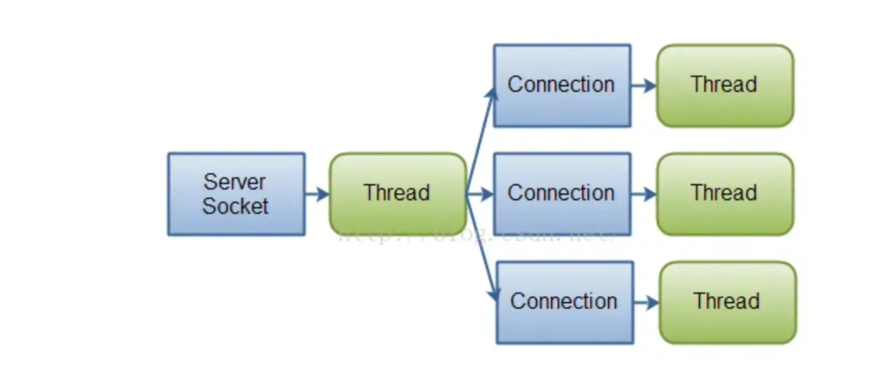

- NIO（non-blocking IO） ：Java 1.4 引入的 java.nio 包，提供了 Channel、Selector、Buffer 等新的抽象，可以构建多路复用的、同步非阻塞 IO 程序，同时提供了更接近操作系统底层高性能的数据操作方式。

  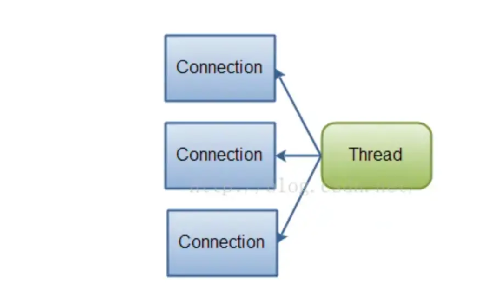

  1. 线程在调用 `read()` / `write()` 时不会阻塞，==如果没有数据，直接返回 0 或空结果。==

  2. Channel + Selector + Buffer

     核心组件：

     1. **Channel**
        1. 类似 BIO 的 Socket，但可以 **非阻塞**模式。
        2. `SocketChannel`、`ServerSocketChannel`、`DatagramChannel` 等。
     2. **Selector**
        1. 就是 **事件轮询器**，一个线程可以注册多个 Channel，监听它们的 **读/写/连接/可写事件**。
        2. 当某个 Channel 有事件发生时，Selector 会通知线程。
     3. **Buffer**
        1. 用来存放读写的数据。

     ==NIO 返回 `0` 并不是数据丢了，而是“内核缓冲区此刻没新数据”。==

     ==数据始终先进入 **内核 socket 缓冲区**，等你来取。==

     ==TCP 本身保证可靠传输，不会因为你 `read` 慢一点就丢。==

- AIO（Asynchronous IO） ：是 Java 1.7 之后引入的包，是 NIO 的升级版本，提供了异步非堵塞的 IO 操作方式，所以人们叫它 AIO（Asynchronous IO），异步 IO 是基于事件和回调机制实现的，也就是应用操作之后会直接返回，不会堵塞在那里，当后台处理完成，操作系统会通知相应的线程进行后续的操作。

| 特性         | 同步 I/O                                                     | 异步 I/O                  |
| ------------ | ------------------------------------------------------------ | ------------------------- |
| 谁来搬数据   | 应用线程自己搬                                               | ==操作系统帮忙搬==        |
| 调用是否阻塞 | 调用可能阻塞（BIO）或不阻塞（NIO），但最后还是要应用线程等/搬 | 调用立即返回，OS 异步处理 |
| 应用线程角色 | 发请求 + 等待/搬运数据                                       | 只发请求，最后等通知      |
| 效率         | 多线程下容易线程爆炸                                         | 高效，线程可专注业务逻辑  |

**多线程假异步**：你雇了一个小弟（线程），让他在门口等外卖，你自己去忙别的。小弟拿到外卖再叫你。

**真正 AIO**：你点外卖时告诉骑手“送到就放冰箱”，骑手送到后直接帮你放冰箱，然后发消息通知你，**根本不需要小弟**。

------

### NIO是怎么实现的？

NIO是一种同步非阻塞的IO模型，所以也可以叫NON-BLOCKINGIO。同步是指线程不断轮询IO事件是否就绪，非阻塞是指线程在等待IO的时候，可以同时做其他任务。

同步的核心就==Selector==（I/O多路复用），Selector代替了线程本身==轮询IO事件==，避免了阻塞同时减少了不必要的线程消耗；非阻塞的核心就是通道和缓冲区，当IO事件就绪时，可以通过==写到缓冲区，保证IO的成功==，而无需线程阻塞式地等待。

NIO由一个专门的线程处理所有IO事件，并负责分发。事件驱动机制，事件到来的时候触发操作，不需要阻塞的监视事件。线程之间通过wait,notify通信，减少线程切换。

NIO主要有三大核心部分：==Channel(通道)，Buffer(缓冲区), Selector==。传统IO基于字节流和字符流进行操作，而NIO基于Channel和Buffer(缓冲区)进行操作，数据总是从通道读取到缓冲区中，或者从缓冲区写入到通道中。

Selector(选择区)用于监听多个通道的事件（比如：连接打开，数据到达）。因此，单个线程可以监听多个数据通道。

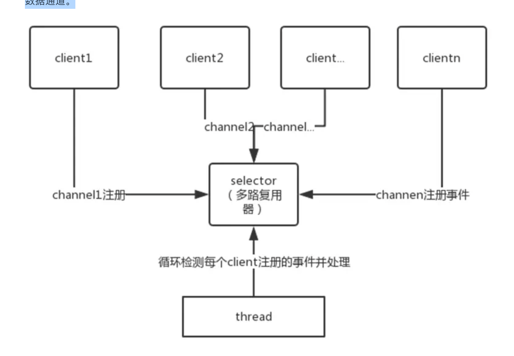

------

### 你知道有哪个框架用到NIO了吗？

==Netty。==

Netty 的 I/O 模型是基于非阻塞 I/O 实现的，底层依赖的是 NIO 框架的多路复用器 Selector。采用 epoll 模式后，只需要一个线程负责 Selector 的轮询。当有数据处于就绪状态后，需要一个事件分发器（Event Dispather），它负责将读写事件分发给对应的读写事件处理器（Event Handler）。事件分发器有两种设计模式：Reactor 和 Proactor，Reactor 采用同步 I/O， Proactor 采用异步 I/O。

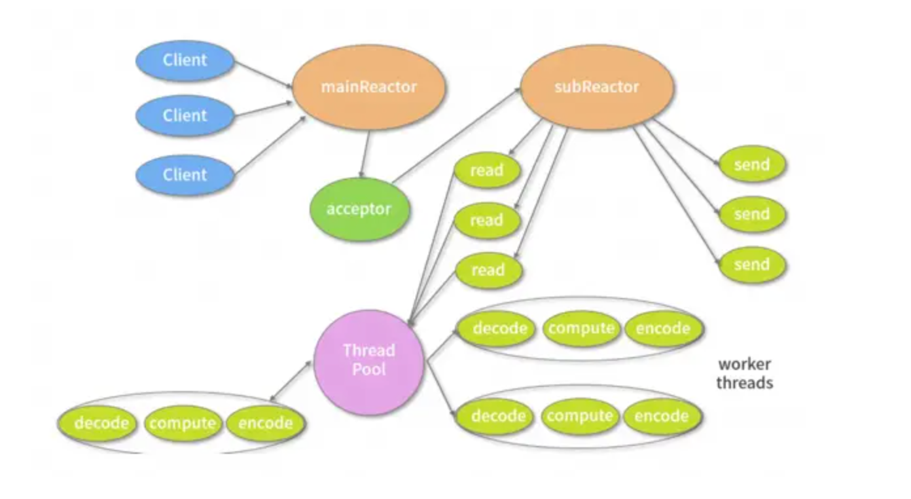

Reactor 实现相对简单，适合处理耗时短的场景，对于耗时长的 I/O 操作容易造成阻塞。Proactor 性能更高，但是实现逻辑非常复杂，适合图片或视频流分析服务器，目前主流的事件驱动模型还是依赖 select 或 epoll 来实现。

------

## Native方法解释一下

在Java中，native方法是一种特殊类型的方法，它允许Java代码调用外部的本地代码，即用==C、C++或其他语言编写的代码==。native关键字是Java语言中的一种声明，用于标记一个方法的实现将在外部定义。

在Java类中，native方法看起来与其他方法相似，只是其方法体由native关键字代替，没有实际的实现代码。例如：

```java
public class NativeExample {
    public native void nativeMethod();
}
```

要实现native方法，你需要完成以下步骤：

1. **生成JNI头文件**：使用javah工具从你的Java类生成C/C++的头文件，这个头文件包含了所有native方法的原型。
2. **编写本地代码**：使用C/C++编写本地方法的实现，并确保方法签名与生成的头文件中的原型匹配。
3. **编译本地代码**：将C/C++代码编译成动态链接库（DLL，在Windows上），共享库（SO，在Linux上）
4. **加载本地库**：在Java程序中，使用System.loadLibrary()方法来加载你编译好的本地库，这样JVM就能找到并调用native方法的实现了。

------

# Java集合

## 概念

### 数组与集合区别，用过哪些？

数组和集合的区别：

- 数组是固定长度的数据结构，一旦创建长度就无法改变，而集合是==动态长度==的数据结构，可以根据需要动态增加或减少元素。
- 数组可以包含基本数据类型和对象，而集合==只能包含对象==。
- 数组可以直接访问元素，而集合需要==通过迭代器==或其他==方法==访问元素。

我用过的一些 Java 集合类：

1. **ArrayList：** 动态数组，实现了List接口，支持动态增长。
2. **LinkedList：** 双向链表，也实现了List接口，支持快速的插入和删除操作。
3. **HashMap：** 基于哈希表的Map实现，存储键值对，通过键快速查找值。
4. **HashSet：** 基于HashMap实现的Set集合，用于存储唯一元素。
5. **TreeMap：** 基于红黑树实现的有序Map集合，可以按照键的顺序进行排序。
6. **LinkedHashMap：** 基于哈希表和双向链表实现的Map集合，保持插入顺序或访问顺序。
7. **PriorityQueue：** 优先队列，可以按照比较器或元素的自然顺序进行排序。

------

### 说说Java中的集合？

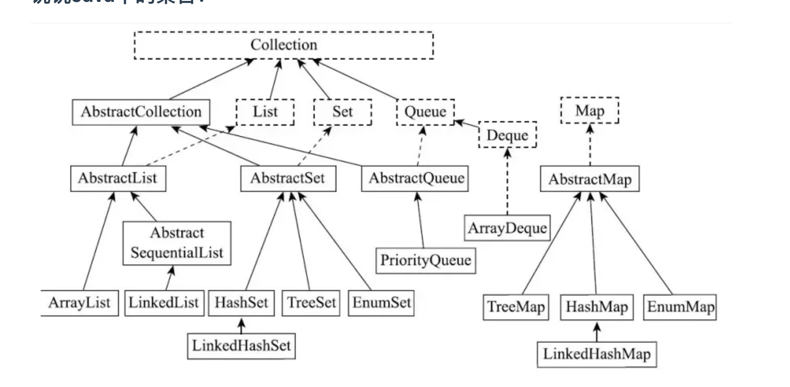

List是有序的Collection，使用此接口能够精确的控制每个元素的插入位置，用户能根据索引访问List中元素。常用的实现List的类有==LinkedList，ArrayList，Vector，Stack==。

- ArrayList是容量可变的==非线程安全==列表，其底层使用数组实现。当几何扩容时，会创建更大的数组，并把原数组复制到新数组。ArrayList支持对元素的快速随机访问，但插入与删除速度很慢。
- LinkedList本质是一个==双向链表==，与ArrayList相比，，其插入和删除速度更快，但随机访问速度更慢。

Set不允许存在重复的元素，与List不同，set中的元素是无序的。常用的实现有HashSet，LinkedHashSet和TreeSet。

- HashSet==通过HashMap实现==，HashMap的Key即HashSet存储的元素，所有Key都是用相同的Value，一个名为PRESENT的Object类型常量。使用Key保证元素唯一性，但不保证有序性。由于HashSet是HashMap实现的，因此线程不安全。
- LinkedHashSet==继承自HashSet==，通过==LinkedHashMap==实现，使用双向链表维护元素插入顺序。
- TreeSet通过==TreeMap==实现的，添加元素到集合时按照比较规则将其插入合适的位置，保证插入后的集合仍然有序。

Map 是一个键值对集合，存储键、值和之间的映射。Key 无序，唯一；value 不要求有序，允许重复。==Map 没有继承于 Collection 接口==，从 Map 集合中检索元素时，只要给出键对象，就会返回对应的值对象。主要实现有TreeMap、HashMap、HashTable、LinkedHashMap、ConcurrentHashMap

- HashMap：JDK1.8 之前 HashMap 由==数组+链表==组成的，数组是 HashMap 的主体，链表则是主要为了解决哈希冲突而存在的（“拉链法”解决冲突），JDK1.8 以后在解决哈希冲突时有了较大的变化，当链表长度大于阈值（默认为 8）时，将链表转化为==红黑树==，以减少搜索时间
- LinkedHashMap：LinkedHashMap 继承自 ==HashMap==，所以它的底层仍然是基于拉链式散列结构即由数组和链表或红黑树组成。另外，LinkedHashMap 在上面结构的基础上，==增加了一条双向链表==，使得上面的结构可以保持键值对的插入顺序。同时通过对链表进行相应的操作，实现了访问顺序相关逻辑。
- HashTable：数组+链表组成的，数组是 HashTable 的主体，链表则是主要为了解决哈希冲突而存在的
- TreeMap：红黑树（自平衡的排序二叉树）
- ConcurrentHashMap：Node数组+链表+红黑树实现，线程安全的（jdk1.8以前Segment锁，1.8以后volatile + CAS 或者 synchronized）

------

### 讲讲CAS

#### 1️⃣ 什么是 CAS？

CAS 全称是 **Compare And Swap**（比较并交换）。
 它是一种 **乐观锁** 思想的实现方式，广泛用于并发编程里保证线程安全。

简单说：

- 你有一个变量的值（比如 `10`）。
- 线程想更新它时，先检查它的当前值是不是期望的值（比如还等于 `10`）。
- 如果是，就把它更新为新值（比如 `11`）；如果不是，就说明在这期间有其他线程修改过了，更新失败，需要重试。

------

#### 2️⃣ 为什么要有 CAS？

在多线程里：

- 如果用 **synchronized**，会加锁 → 阻塞，性能差。
- CAS 提供了一种 **无锁并发** 机制，不需要线程阻塞，就能实现安全更新。

------

#### 3️⃣ CAS 的流程（举例）

假设一个变量 `count = 10`，线程要做 `count++` 操作。

1. **读取当前值**：线程先读取到 `10`。
2. **比较（Compare）**：检查内存里 `count` 现在是不是 `10`。
3. **交换（Swap）**：如果是，就把它更新为 `11`；如果不是，就说明被别人改过了，不更新。

如果失败 → 线程重新读取，继续尝试，直到成功。

------

#### 4️⃣ Java 中的 CAS

在 Java 里，CAS 由 **`Unsafe` 类** 和 **CPU 的==原子指令==**（如 `cmpxchg`）实现。

典型用法：

```java
import java.util.concurrent.atomic.AtomicInteger;

public class CASDemo {
    public static void main(String[] args) {
        AtomicInteger count = new AtomicInteger(10);

        // 期望值=10，更新值=11
        boolean success = count.compareAndSet(10, 11);

        System.out.println("更新成功了吗？ " + success); // true
        System.out.println("当前值： " + count.get()); // 11
    }
}
```

这里 `compareAndSet(10, 11)` 就是 CAS 的过程。

------

#### 5️⃣ CAS 的问题

虽然很高效，但 CAS 也有缺点：

1. **ABA 问题**
   - 比如一个值从 `A → B → A`，CAS 检查时发现还是 `A`，以为没变，其实中间被修改过。
   - 解决方法：加版本号（`AtomicStampedReference`）。
2. **自旋开销大**
   - 如果竞争激烈，CAS 可能会一直失败 → 一直重试 → 消耗 CPU。
3. **只能保证单个变量的原子操作**
   - 多变量的原子操作就需要锁了。

------

#### 6️⃣ 总结

- **CAS** = 无锁并发的一种实现 → "比较+交换"。
- 核心 API：`AtomicInteger`、`compareAndSet`。
- 优点：高效、非阻塞。
- 缺点：有 ABA 问题、自旋开销大。

------

###  ==Java中的线程安全的集合是什么？ 待仔细研究底层==

在 ==java.util 包==中的线程安全的类主要 2 个，其他都是非线程安全的。

- **Vector**：线程安全的==动态数组==，其内部方法基本都经过==synchronized==修饰，如果不需要线程安全，并不建议选择，毕竟同步是有额外开销的。Vector 内部是使用对象数组来保存数据，可以根据需要自动的增加容量，当数组已满时，会创建新的数组，并拷贝原有数组数据。
- **Hashtable**：线程安全的==哈希表==，HashTable 的加锁方法是给每个方法加上 ==synchronized== 关键字，这样锁住的是整个 Table 对象，不支持 null 键和值，由于同步导致的性能开销，所以已经很少被推荐使用，如果要保证线程安全的哈希表，可以用ConcurrentHashMap。

java.util.concurrent 包提供的都是线程安全的集合：

并发Map：

- **ConcurrentHashMap**：它与 HashTable 的主要区别是二者加锁粒度的不同，在**JDK1.7**，ConcurrentHashMap加的是分段锁，也就是Segment锁，每个Segment 含有整个 table 的一部分，这样不同分段之间的并发操作就互不影响。在**JDK 1.8** ，它取消了Segment字段，直接在==table元素上加锁，实现对每一行进行加锁==，进一步减小了并发冲突的概率。对于put操作，如果Key对应的数组元素为null，则==通过CAS==操作（Compare and Swap）将其设置为当前值。如果Key对应的数组元素（也即链表表头或者树的根元素）不为null，则对该元素使用 synchronized 关键字申请锁，然后进行操作。如果该 put 操作使得当前链表长度超过一定阈值，则将==该链表转换为红黑树==，从而提高寻址效率。

  | 特性     | JDK 1.7                    | JDK 1.8+                               |
  | -------- | -------------------------- | -------------------------------------- |
  | 数据结构 | Segment + HashEntry        | Node[] + 链表/红黑树                   |
  | 写操作   | Segment 锁                 | CAS（空桶）+ 局部锁（冲突桶）          |
  | 读操作   | 无锁或部分 volatile        | 无锁读取，依赖 volatile 可见性         |
  | 扩容     | Segment 内部扩容           | 整个 table 扩容 + volatile 替换        |
  | 并发性能 | Segment 粒度锁，高并发受限 | 空桶 CAS 无锁，桶冲突锁局部 → 性能更高 |

- **ConcurrentSkipListMap**：实现了一个基于==SkipList（跳表）==算法的==可排序==的并发集合，SkipList是一种可以在对数预期时间内完成搜索、插入、删除等操作的数据结构，通过维护多个指向其他元素的“跳跃”链接来实现高效查找。==无锁 + CAS + volatile==

并发Set：

- **ConcurrentSkipListSet**：是线程安全的有序的集合。底层是使用==ConcurrentSkipListMap==实现。
- **CopyOnWriteArraySet**：是线程安全的Set实现，它是线程安全的==无序==的集合，可以将它理解成线程安全的HashSet。有意思的是，CopyOnWriteArraySet和HashSet虽然都继承于共同的父类AbstractSet；但是，HashSet是通过“散列表”实现的，而CopyOnWriteArraySet则是通过“==动态数组==(CopyOnWriteArrayList)”实现的，并不是散列表。

并发List：

- **CopyOnWriteArrayList**：它是 ArrayList 的线程安全的变体，其中所有写操作（add，set等）都通过对底层数组进行==全新复制==来实现，允许存储 null 元素。即当对象进行写操作时，使用了==Lock锁==做同步处理，内部拷贝了原数组，并在新数组上进行添加操作，最后将新数组替换掉旧数组；若进行的读操作，则直接返回结果，操作过程中不需要进行同步。

并发 Queue：

- **ConcurrentLinkedQueue**：是一个适用于高并发场景下的队列，它通过==无锁的方式(CAS)==，实现了高并发状态下的高性能。通常，ConcurrentLinkedQueue 的性能要好于 BlockingQueue 。
- **BlockingQueue**：与 ConcurrentLinkedQueue 的使用场景不同，BlockingQueue 的主要功能并不是在于提升高并发时的队列性能，而在于简化多线程间的数据共享。BlockingQueue 提供一种读写==阻塞==等待的机制，即如果消费者速度较快，则 BlockingQueue 则可能被清空，此时消费线程再试图从 BlockingQueue 读取数据时就会被阻塞。反之，如果生产线程较快，则 BlockingQueue 可能会被装满，此时，生产线程再试图向 BlockingQueue 队列装入数据时，便会被阻塞等待。

并发 Deque：

- **LinkedBlockingDeque**：是一个线程安全的双端队列实现。它的内部使用链表结构，每一个节点都维护了一个前驱节点和一个后驱节点。LinkedBlockingDeque 没有进行读写锁的分离，因此==同一时间只能有一个线程对其进行操作==
- **ConcurrentLinkedDeque**：ConcurrentLinkedDeque是一种基于链接节点的无限并发链表。可以安全地并发执行插入、删除和访问操作。当许多线程同时访问一个公共集合时，ConcurrentLinkedDeque是一个合适的选择。

------

### 🚨多线程下集合不安全体现在

---

#### 1. **元素覆盖（数据丢失）**

- 多个线程同时 `add` 元素，底层数组在写入时没有同步控制。
- 可能导致两个线程在**同一个数组下标**位置写数据，后写的覆盖先写的。
- 表现：集合里元素变少，某些数据丢了。

------

#### 2. **size 计数不一致**

- 线程 A 和线程 B 同时插入数据：
  - A 读到 `size = 9`，准备写入。
  - B 也读到 `size = 9`，也准备写入。
  - 最终两者都写成功，但 `size` 只加了一次，结果实际有 2 个元素被加进去了，但 `size` 只显示 +1。
- 表现：`size` 小于真实元素数量。

------

#### 3. **扩容时的数据错乱**

- 当集合容量不足需要扩容（如 `ArrayList` 会 `new` 一个更大的数组然后 `System.arraycopy`），
- 如果多个线程同时触发扩容，可能导致：
  - 部分元素丢失；
  - 新数组和旧数组之间数据不完整；
  - `NullPointerException` 或数组越界。

这个问题问得特别好 👍，我们来一步步还原一下 **集合扩容时在多线程环境下为什么会出错**。

------

**🚗 背景：ArrayList 扩容机制**

以 `ArrayList` 为例：
 当 `add()` 时发现容量不足，会触发扩容：

1. 计算新容量（通常是 `oldCapacity + oldCapacity >> 1` → 1.5 倍）。
2. `new Object[newCapacity]` 新建一个更大的数组。
3. `System.arraycopy` 把旧数组的数据复制到新数组。
4. 把 `elementData` 引用指向新数组。

这一整套流程，本质是 **“读旧数组 → 创建新数组 → 拷贝数据 → 替换引用”**。
 这个过程并不是原子操作，多线程下很容易出错。

------

**⚡ 出错场景举例**

##### 3. 1 **部分元素丢失**

- 线程 A 和线程 B 同时发现需要扩容。
- 线程 A 先创建了一个新数组并拷贝旧数据（比如 0..9 下标的数据）。
- 线程 B 也基于旧数组（扩容前的）创建了新数组并拷贝数据。
- 最后可能 **B 的新数组覆盖了 A 的结果**。
  - 如果 A 在复制过程中已经写入了某些新增元素，B 并没有复制到，就丢了。

------

##### 3.2  **新数组和旧数组数据不完整**

- 线程 A 正在 `System.arraycopy` 时，线程 B 把 `elementData` 改成了它的新数组。
- A 复制了一半，结果 `elementData` 已经被别的线程替换掉了，后续写入的不是它以为的目标数组。
- 导致 **新数组里有一部分是旧数据，一部分是空/null**。

```
线程 A：开始扩容，记下当时的 size = 100，准备拷贝 100 个元素。

线程 A：拷贝到第 50 个元素时，被挂起。

线程 B：在这期间，往集合里加了 50 个新元素 → size = 150，触发扩容并完成，elementData 被替换成了 B 的新数组（里面有 150 个元素）。

线程 A：恢复执行，它继续从 elementData[50] 拷到 elementData[99]，最后完成并做 elementData = newArrayA。

结果：

A 的新数组只有 100 个元素（因为它当时看到的 size 就是 100）。

后来 B 新增的 50 个元素在 A 的数组里根本不存在 → 直接丢失。

于是最终 elementData 指向了 A 的数组，看起来像 “一半是数据，一半是 null/丢了”。
```

------

##### 3.3  **NullPointerException 或数组越界**

- 线程 A 读到 `size = 10`，准备在下标 10 插入元素。
- 扩容还没来得及做完，线程 B 改了 `elementData`，但 A 还在用旧数组插入。
- 可能导致：
  - 插入越界（`IndexOutOfBoundsException`）。
  - 如果引用错乱，`elementData` 变成 `null` 或部分未初始化区域，就可能 `NullPointerException`。

```
线程 A看到的 size 和容量是旧快照，它的扩容只是针对“当时的需求”

其他线程在 A 扩容期间又新增了很多元素，触发了自己的扩容 → 需要比 A 多得多的容量

当这些线程写入元素时，A 的新数组容量已经不够用了 → 就可能出现 IndexOutOfBoundsException

同时，A 的数组里未拷贝/未初始化的位置就是 null → 如果访问就可能 NullPointerException
```


------

#### 4. **迭代时结构被修改**

- 线程 A 正在 `for-each` 或 `Iterator` 遍历，线程 B 在 `add/remove`。
- 因为 `modCount` 没有同步更新，导致抛 `ConcurrentModificationException`（fail-fast 机制）。
- 这就是「遍历时修改」的典型问题。

------

#### 📝 小结

集合（`ArrayList`、`HashMap`、`HashSet` 等）的线程不安全主要体现在：

1. **新增元素时索引覆盖** ✅
2. **`size` 统计出错** ✅
3. **扩容过程导致数据丢失/错乱** ✅
4. **遍历时并发修改导致异常** ✅


------

## List

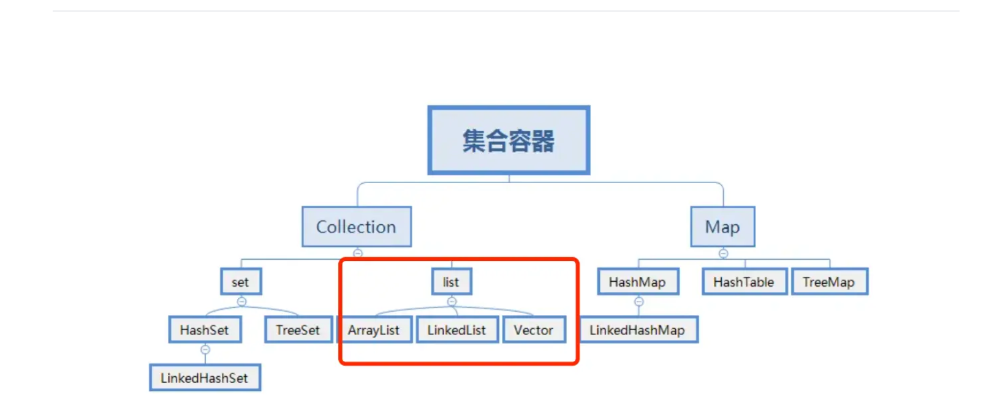

常见的List集合（==非线程安全==）：

- `ArrayList`基于==动态数组==实现，它允许快速的随机访问，即通过索引访问元素的时间复杂度为 O (1)。在添加和删除元素时，如果操作位置不是列表末尾，可能需要移动大量元素，性能相对较低。适用于需要频繁随机访问元素，而对插入和删除操作性能要求不高的场景，如数据的查询和展示等。
- `LinkedList`基于==双向链表==实现，在插入和删除元素时，只需修改链表的指针，不需要移动大量元素，时间复杂度为 O (1)。但随机访问元素时，需要从链表头或链表尾开始遍历，时间复杂度为 O (n)。适用于需要频繁进行插入和删除操作的场景，如队列、栈等数据结构的实现，以及需要在列表中间频繁插入和删除元素的情况。

常见的List集合（==线程安全==）：

- `Vector`和`ArrayList`类似，也是基于==数组==实现。`Vector`中的方法大多是同步的，这使得它在多线程环境下可以保证数据的一致性，但在单线程环境下，由于同步带来的开销，性能会略低于`ArrayList`。
- `CopyOnWriteArrayList`在对列表进行修改（如添加、删除元素）时，会==创建一个新的底层数组，将修改操作应用到新数组上==，而读操作仍然在原数组上进行，这样可以保证读操作不会被写操作阻塞，实现了==读写分离==，提高了并发性能。适用于读操作远远多于写操作的并发场景，如事件监听列表等，在这种场景下可以避免大量的锁竞争，提高系统的性能和响应速度。

###  讲一下java里面list的几种实现，几种实现有什么不同？

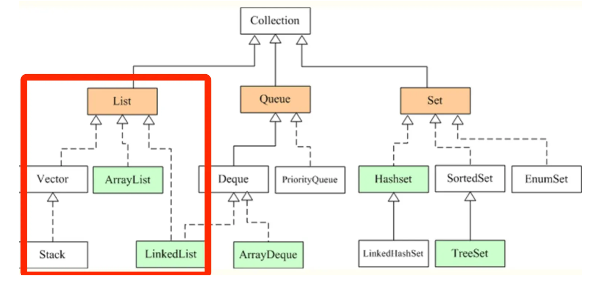

- Vector 是 Java 早期提供的线程安全的动态数组，如果不需要线程安全，并不建议选择，毕竟同步是有额外开销的。Vector 内部是使用==对象数组==来保存数据，可以根据需要自动的增加容量，当数组已满时，会创建新的数组，并拷贝原有数组数据。
- ArrayList 是应用更加广泛的==动态数组==实现，它本身不是线程安全的，所以==性能要好==很多。与 Vector 近似，ArrayList 也是可以根据需要调整容量，不过两者的调整逻辑有所区别，Vector 在扩容时会提高 1 倍，而 ArrayList 则是==增加 50%==。
- LinkedList 顾名思义是 Java 提供的==双向链表==，所以它不需要像上面两种那样调整容量，它也不是线程安全的。

------

### list可以一边遍历一边修改元素吗？

普通集合遍历中 **不能直接修改结构**，否则会报`ConcurrentModificationException`异常。

使用 **Iterator** 可以安全删除当前元素；**ListIterator** 可以修改或添加元素。

使用 **并发集合** 可以在遍历时修改，但行为可能不是完全同步可见。看到的是**遍历开始时的快照**

------

###  list如何快速删除某个指定下标的元素？

`ArrayList`提供了`remove(int index)`方法来删除指定下标的元素，该方法在删除元素后，会将后续元素向前移动，以填补被删除元素的位置。如果删除的是列表末尾的元素，==时间复杂度为 O (1)==；如果删除的是列表中间的元素，==时间复杂度为 O (n)==，n 为列表中元素的个数，因为==需要移动后续的元素==。示例代码如下：

```java
import java.util.ArrayList;
import java.util.List;

public class ArrayListRemoveExample {
    public static void main(String[] args) {
        List<Integer> list = new ArrayList<>();
        list.add(1);
        list.add(2);
        list.add(3);

        // 删除下标为1的元素
        list.remove(1);

        System.out.println(list);
    }
}
```

`LinkedList`的`remove(int index)`方法也可以用来删除指定下标的元素。它需要先==遍历到指定下标位置，然后修改链表的指针来删除元素==。时间复杂度为 ==O (n)==，n 为要删除元素的下标。不过，如果已知要删除的元素是链表的头节点或尾节点，可以直接通过修改头指针或尾指针来实现删除，时间复杂度为 ==O (1)==。示例代码如下：

```java
import java.util.LinkedList;
import java.util.List;

public class LinkedListRemoveExample {
    public static void main(String[] args) {
        List<Integer> list = new LinkedList<>();
        list.add(1);
        list.add(2);
        list.add(3);

        // 删除下标为1的元素
        list.remove(1);

        System.out.println(list);
    }
}
```

`CopyOnWriteArrayList`的`remove`方法同样可以删除指定下标的元素。由于`CopyOnWriteArrayList`在写操作时会创建一个新的数组，所以删除操作的时间复杂度==取决于数组的复制速度==，通常为 O (n)，n 为数组的长度。但在并发环境下，它的删除操作不会影响读操作，具有较好的并发性能。示例代码如下：

```java
import java.util.concurrent.CopyOnWriteArrayList;

public class CopyOnWriteArrayListRemoveExample {
    public static void main(String[] args) {
        CopyOnWriteArrayList<Integer> list = new CopyOnWriteArrayList<>();
        list.add(1);
        list.add(2);
        list.add(3);

        // 删除下标为1的元素
        list.remove(1);

        System.out.println(list);
    }
}
```

### ArrayList线程安全吗？把ArrayList变成线程安全有哪些方法？

不是线程安全的，ArrayList变成线程安全的方式有：

- 使用Collections类的synchronizedList方法将ArrayList包装成线程安全的List：

```java
List<String> synchronizedList = Collections.synchronizedList(arrayList);
```

- 使用CopyOnWriteArrayList类代替ArrayList，它是一个线程安全的List实现：

```java
CopyOnWriteArrayList<String> copyOnWriteArrayList = new CopyOnWriteArrayList<>(arrayList);
```

- 使用Vector类代替ArrayList，Vector是线程安全的List实现：

```java
Vector<String> vector = new Vector<>(arrayList);
```

------

### ArrayList并发问题

#### 1. 为什么不存在size+2而元素只新增1

------

**先看 `add` 的关键逻辑：**

```java
elementData[size] = e;  // 写数组
size++;                 // 自增
```

注意：`size++` **不是原子操作**，它实际上分三步：

1. 读出 `size`
2. `+1`
3. 写回

------

两个线程同时 `add` 的过程（假设初始 `size=0`）

**线程 A**

- 读到 `size = 0`
- 准备写 `elementData[0]`
- （此时被切换）

**线程 B**

- 也读到 `size = 0`
- 写 `elementData[0] = e2`
- 执行 `size++`：读到 0，加 1，写回 `size = 1`

**线程 A 继续**

- 写 `elementData[0] = e1`（覆盖掉 e2）
- 执行 `size++`：**注意它之前也读到 0**，所以结果还是写回 `size = 1`

------

**最终结果**

- 数组 `elementData[0] = e1`
- `size = 1`
- **现象**：两个元素试图插入，但最后只保留了 1 个，`size` 也是 1。

------

**为什么不会出现 “新增一个元素但 size=2”**

关键在于：

- 两个线程在读 `size` 时都读到 **相同的旧值 (0)**
- 后面 `size++` 的写回结果会互相覆盖
- 结果只会是 **最后一次写入的那个值（1）**，不会累加成 2

换句话说：

- 并发时可能 “多加了元素但 size 只加了一次” ✅
- 但不会 “少加元素却 size 多加了” ❌

------

类比

就像两个人在纸上同时写 “1”，结果还是 **1**，不会 magically 变成 “2”。

------

#### 2. 那size+1但是新增两个元素情况是怎么样的呢

------

**回顾 `add` 代码**

```java
elementData[size] = e; // 先写数组
size++;                // 再自增
```

关键点：

1. `elementData[size] = e` 是基于当前读到的 **旧 size 值**
2. `size++` 是非原子的（读 -> 加 1 -> 写）

------

**场景：`size = 0`，两个线程并发调用 `add`**

**线程 A**

- 读到 `size = 0`
- 写 `elementData[0] = e1`
- 执行 `size++`（假设还没写回）

**线程 B（同时运行）**

- **注意此时线程 B 可能已经看到 A 的写入了**
- 线程 B 也读到 `size = 0`（因为自增还没写回）
- 写 `elementData[0] = e2`（覆盖掉 e1）
- 执行 `size++`，写回 `size = 1`

**线程 A 再继续**

- 把自己的 `size++` 写回（同样是 1）

------

**最终结果**

- `elementData[0] = e2`（e1 被覆盖）
- `size = 1`
- **现象：有两个线程调用了 `add`，但最终只新增了一个元素，size 也是 1**

------

**那 size=1 但数组里有两个不同元素的情况呢？**

有的！发生在 **不同索引写入但 size 丢失** 的时候。

**假设初始 `size = 0`，线程 A 和 B 几乎同时执行：**

- A：读到 `size=0` → 写 `elementData[0] = e1` → 准备 `size=1`
- B：**稍晚一点**，这次可能读到了 **A 已经写回的 size=1**
  → 写 `elementData[1] = e2` → 准备 `size=2`

但因为竞争，假设最后写回的是 **A 的 size=1**（覆盖了 B 的 `2`）。

------

**最终结果：**

- `elementData[0] = e1`
- `elementData[1] = e2`
- `size = 1`

👉 这就是 “数组里有两个元素，但 size 只加了一次”的情况。

------

✅ 总结一下 ArrayList 并发下的可能错乱：

1. **两个线程写同一位置** → 只留下一个元素，`size=1`
2. **两个线程写不同位置** → 数组里 2 个元素，但 `size=1`（size 回退丢失更新）

------

### ArrayList的扩容机制说一下

ArrayList在添加元素时，如果当前元素个数已经达到了内部数组的容量上限，就会触发扩容操作。ArrayList的扩容操作主要包括以下几个步骤：

- 计算新的容量：一般情况下，新的容量会扩大为原容量的==1.5倍==（在JDK 10之后，扩容策略做了调整），然后检查是否超过了最大容量限制。
- 创建新的数组：根据计算得到的新容量，创建一个新的更大的数组。
- 将元素复制：将原来数组中的元素逐个==复制==到新数组中。
- 更新引用：将ArrayList内部指向原数组的引用==指向新数组==。
- 完成扩容：扩容完成后，可以继续添加新元素。

ArrayList的扩容操作涉及到数组的复制和内存的重新分配，所以在频繁添加大量元素时，扩容操作可能会影响性能。为了减少扩容带来的性能损耗，可以在初始化ArrayList时预分配足够大的容量，避免频繁触发扩容操作。

之所以扩容是 1.5 倍，是因为 1.5 可以充分利用移位操作，减少浮点数或者运算时间和运算次数。

```java
// 新容量计算
int newCapacity = oldCapacity + (oldCapacity >> 1);
```

------

### 线程安全的 List， CopyonWriteArraylist是如何实现线程安全的

CopyOnWriteArrayList底层也是通过一个数组保存数据，使用volatile关键字修饰数组，保证当前线程对数组对象重新赋值后，==其他线程可以及时感知到==。

```java
private transient volatile Object[] array;
```

在写入操作时，加了一把互斥锁ReentrantLock以保证线程安全。

```java
public boolean add(E e) {
    //获取锁
    final ReentrantLock lock = this.lock;
    //加锁
    lock.lock();
    try {
        //获取到当前List集合保存数据的数组
        Object[] elements = getArray();
        //获取该数组的长度（这是一个伏笔，同时len也是新数组的最后一个元素的索引值）
        int len = elements.length;
        //将当前数组拷贝一份的同时，让其长度加1
        Object[] newElements = Arrays.copyOf(elements, len + 1);
        //将加入的元素放在新数组最后一位，len不是旧数组长度吗，为什么现在用它当成新数组的最后一个元素的下标？建议自行画图推演，就很容易理解。
        newElements[len] = e;
        //替换引用，将数组的引用指向给新数组的地址
        setArray(newElements);
        return true;
    } finally {
        //释放锁
        lock.unlock();
    }
}
```

看到源码可以知道写入新元素时，首先会先==将原来的数组拷贝一份并且让原来数组的长度+1后就得到了一个新数组==，新数组里的元素和旧数组的元素一样并且长度比旧数组多一个长度，然后将新加入的元素放置都在新数组最后一个位置后，用新数组的地址替换掉老数组的地址就能得到最新的数据了。

在我们执行替换地址操作之前，读取的是老数组的数据，数据是有效数据；执行替换地址操作之后，读取的是新数组的数据，同样也是有效数据，而且使用该方式能比读写都加锁要更加的效率。

现在我们来看读操作，==读是没有加锁的，所以读是一直都能读==

```java
public E get(int index) {
    return get(getArray(), index);
}
```

------

## Map

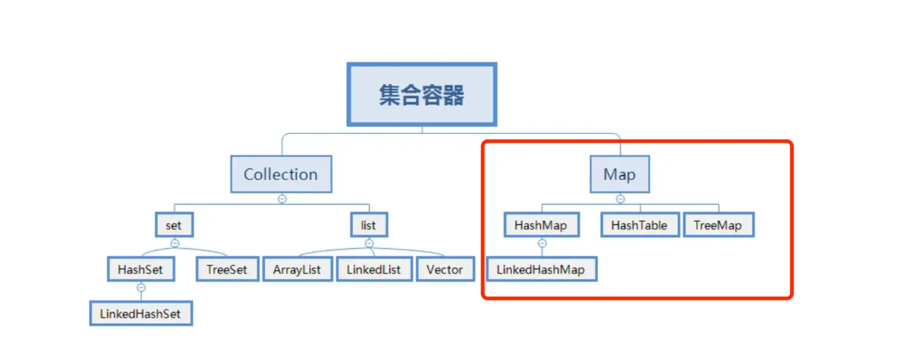

常见的Map集合（非线程安全）：

- `HashMap`是基于哈希表实现的`Map`，它根据键的哈希值来存储和获取键值对，JDK 1.8中是用==数组+链表+红黑树==来实现的。`HashMap`是非线程安全的，在多线程环境下，当多个线程同时对`HashMap`进行操作时，可能会导致数据不一致或出现死循环等问题。比如在扩容时，多个线程可能会同时修改哈希表的结构，从而破坏数据的完整性。
- `LinkedHashMap`继承自`HashMap`，它在`HashMap`的基础上，使用==双向链表维护了键值对的插入顺序==或访问顺序，使得==迭代顺序与插入顺序或访问顺序一致==。由于它继承自`HashMap`，在多线程并发访问时，同样会出现与`HashMap`类似的线程安全问题。
- `TreeMap`是基于==红黑树==实现的`Map`，它可以对键进行排序，默认按照自然顺序排序，也可以通过指定的比较器进行排序。`TreeMap`是非线程安全的，在多线程环境下，如果多个线程同时对`TreeMap`进行插入、删除等操作，可能会破坏红黑树的结构，导致数据不一致或程序出现异常。

常见的Map集合（线程安全）：

- `Hashtable`是早期 Java 提供的线程安全的`Map`实现，它的实现方式与`HashMap`类似，但在方法上使用了`synchronized`关键字来保证线程安全。通过在每个可能修改`Hashtable`状态的方法上加上`synchronized`关键字，使得在同一时刻，只能有一个线程能够访问`Hashtable`的这些方法，从而保证了线程安全。
- `ConcurrentHashMap`在 JDK 1.8 以前采用了==分段锁==等技术来提高并发性能。在`ConcurrentHashMap`中，将==数据分成多个段（Segment），每个段都有自己的锁==。在进行插入、删除等操作时，只需要获取相应段的锁，而不是整个`Map`的锁，这样可以允许多个线程同时访问不同的段，提高了并发访问的效率。在 JDK 1.8 以后是通过 ==volatile + CAS== 或者 synchronized 来保证线程安全的。

------

### HashMap实现原理介绍一下？

在 JDK 1.7 版本之前， HashMap 数据结构是数组和链表，HashMap通过==哈希算法将元素的键（Key）映射到数组中的槽位（Bucket）==。如果多个键映射到同一个槽位，它们会以链表的形式存储在同一个槽位上，因为链表的查询时间是O(n)，所以冲突很严重，一个索引上的链表非常长，效率就很低了。

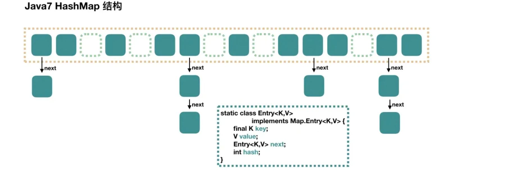

所以在 **JDK 1.8** 版本的时候做了优化，当一个==链表的长度超过8==的时候就转换数据结构，不再使用链表存储，而是使用==**红黑树**==，查找时使用红黑树，时间复杂度O（log n），可以提高查询性能，但是在数量较少时，即==数量小于6时，会将红黑树转换回链表==。

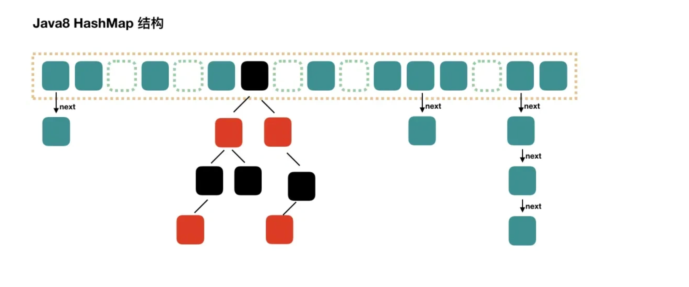

------

### 哈希冲突解决方法有哪些？

- 链接法：使用链表或其他数据结构来存储冲突的键值对，将它们链接在同一个哈希桶中。

- 开放寻址法：在哈希表中找到另一个可用的位置来存储冲突的键值对，而不是存储在链表中。常见的开放寻址方法包括线性探测、二次探测和双重散列。

  | 方法     | 冲突时探测方式                  | 特点                     |
  | -------- | ------------------------------- | ------------------------ |
  | 线性探测 | +1、+2、+3...                   | 简单，主聚集严重         |
  | 二次探测 | +1²、+2²、+3²...                | 缓解主聚集，可能二次聚集 |
  | 双重散列 | +1*h2(k)、+2*h2(k)、+3*h2(k)... | 步长不同，聚集几乎消除   |

  💡 核心区别：

  - **线性探测** → 步长固定 1
  - **二次探测** → 步长随次数平方增长
  - **双重散列** → 步长由第二哈希函数计算，key 不同步长也不同

- 再哈希法（Rehashing）：当发生冲突时，使用另一个哈希函数再次计算键的哈希值，直到找到一个空槽来存储键值对。

- 哈希桶扩容：当哈希冲突过多时，可以动态地扩大哈希桶的数量，重新分配键值对，以减少冲突的概率。

------

### hashmap的put过程介绍一下

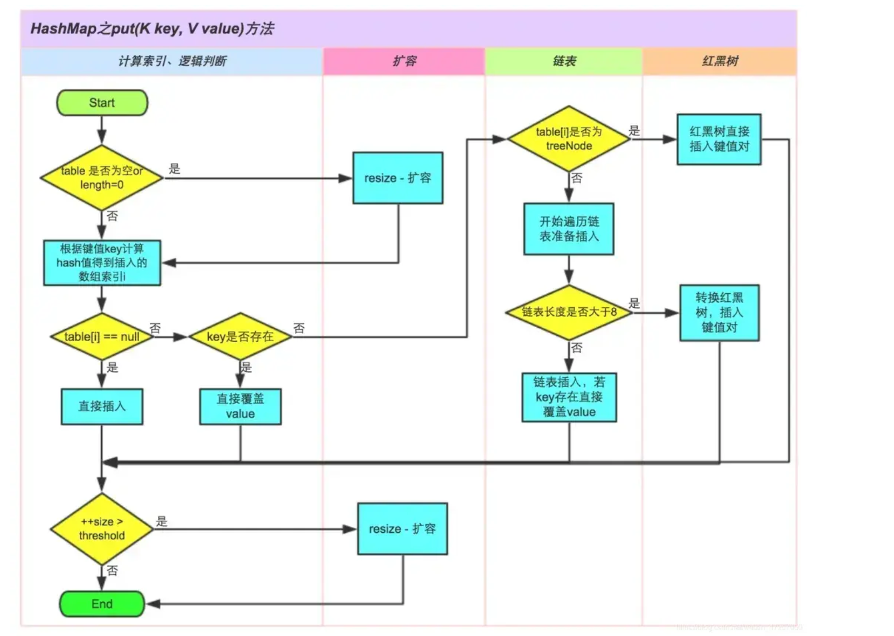

HashMap HashMap的put()方法用于向HashMap中添加键值对，当调用HashMap的put()方法时，会按照以下详细流程执行（JDK8 1.8版本）：

> 第一步：根据要添加的键的哈希码计算在数组中的位置（索引）。

> 第二步：检查该位置是否为空（即没有键值对存在）

- 如果为空，则直接在该位置创建一个新的Entry对象来存储键值对。将要添加的键值对作为该Entry的键和值，并保存在数组的对应位置。将HashMap的修改次数（modCount）加1，以便在进行迭代时发现并发修改。

> 第三步：如果该位置已经存在其他键值对，检查该位置的第一个键值对的哈希码和键是否与要添加的键值对相同？

- 如果相同，则表示找到了相同的键，直接将新的值替换旧的值，完成更新操作。

> 第四步：如果第一个键值对的哈希码和键不相同，则需要遍历链表或红黑树来查找是否有相同的键：

如果键值对集合是链表结构，从链表的头部开始逐个比较键的哈希码和equals()方法，直到找到相同的键或达到链表末尾。

- 如果找到了相同的键，则使用新的值取代旧的值，即更新键对应的值。
- 如果没有找到相同的键，则将新的键值对添加到链表的头部。

如果键值对集合是红黑树结构，在红黑树中使用哈希码和equals()方法进行查找。根据键的哈希码，定位到红黑树中的某个节点，然后逐个比较键，直到找到相同的键或达到红黑树末尾。

- 如果找到了相同的键，则使用新的值取代旧的值，即更新键对应的值。
- 如果没有找到相同的键，则将新的键值对添加到红黑树中。

> 第五步：检查链表长度是否达到阈值（默认为8）：

- 如果链表长度超过==阈值==，且HashMap的数组长度大于等于64，则会将链表转换为红黑树，以提高查询效率。

> 第六步：检查负载因子是否超过阈值（默认为0.75）：

- 如果键值对的数量（size）与数组的长度的比值大于==阈值==，则需要进行扩容操作。

```
HashMap 的 threshold 是为了控制 什么时候扩容（跟 size >= capacity × loadFactor 有关）
int newCap = oldCap << 1;  // 即 oldCap * 2
有 threshold 的是基于哈希的容器（HashMap、HashSet），因为要平衡散列桶大小与元素数量。
```

> 第七步：扩容操作：

- 创建一个新的两倍大小的数组。
- 将旧数组中的键值对重新计算哈希码并分配到新数组中的位置。
- 更新HashMap的数组引用和阈值参数。

> 第八步：完成添加操作。

此外，HashMap是非线程安全的，如果在多线程环境下使用，需要采取额外的同步措施或使用线程安全的ConcurrentHashMap。

------

### HashMap的put(key,val)和get(key)过程

- 存储对象时，我们将K/V传给put方法时，它调用hashCode计算hash从而得到bucket位置，进一步存储，HashMap会根据当前bucket的占用情况自动调整容量(==超过Load Facotr则resize为原来的2倍==)。
- 获取对象时，我们将K传给get，它调用hashCode计算hash从而得到==bucket==位置，并进一步调用equals()方法确定键值对。如果发生碰撞的时候，Hashmap通过链表将产生碰撞冲突的元素组织起来，在Java 8中，如果一个bucket中碰撞冲突的元素==超过某个限制(默认是8)，则使用红黑树来替换链表==，从而提高速度。

------

### HashMap在多线程下可能会出现的问题？

- JDK1.7中的 HashMap 使用头插法插入元素，在多线程的环境下，==扩容的时候有可能导致环形链表的出现==，形成死循环。因此，JDK1.8使用尾插法插入元素，在扩容时会保持链表元素原本的顺序，不会出现环形链表的问题。

  ```
  3️⃣ 一个典型示例（头插法）
  
  假设 JDK 1.7 使用 头插法迁移链表：
  
  原链表：1 -> 2 -> 3
  
  线程 A 复制节点 1，设置 1.next = null → 准备放入新桶
  
  线程 B 同时复制节点 2，设置 2.next = 1
  
  线程 A 设置 1.next = 2
  
  最终形成循环：1 -> 2 -> 1 -> 2 ...
  
  这种情况是由于多线程同时修改同一个链表节点的 next 引起的。
  ```

  

- 多线程同时执行 put 操作，如果计算出来的索引位置是相同的，那会造成前一个 key 被后一个 key 覆盖，从而导致元素的丢失。此问题在JDK 1.7和 JDK 1.8 中都存在。

- **空指针异常（NullPointerException）**：如果你尝试用 `null` 作为键调用 `get` 方法，而 `HashMap` 没有被初始化（即为 `null`），那么会抛出空指针异常。不过，如果 `HashMap` 已经初始化，使用 `null` 作为键是允许的，因为 `HashMap` 支持 `null` 键。

- **线程安全**：`HashMap` 本身不是线程安全的。如果在多线程环境中，没有适当的同步措施，同时对 `HashMap` 进行读写操作可能会导致不可预测的行为。例如，在一个线程中调用 `get` 方法读取数据，而另一个线程同时修改了结构（如增加或删除元素），可能会导致读取操作得到错误的结果或抛出 `ConcurrentModificationException`。如果需要在多线程环境中使用类似 `HashMap` 的数据结构，可以考虑使用 `ConcurrentHashMap`。

  ```java
  volatile操作是原子性的 非volatile是非原子的 因此可能出现写一半就被读取的情况
  ```

  

------

### HashMap一般用什么做Key？为啥String适合做Key呢？

用 string 做 key，因为 ==String对象是不可变的==，一旦创建就不能被修改，这确保了==Key的稳定性==。如果Key是可变的，可能会导致hashCode和equals方法的不一致，进而影响HashMap的正确性。

------

### 为什么HashMap要用红黑树而不是平衡二叉树？

- 平衡二叉树追求的是一种 **“完全平衡”** 状态：任何结点的左右子树的高度差不会超过 1，优势是树的结点是很平均分配的。这个要求实在是太严了，导致每次进行插入/删除节点的时候，几乎都会破坏平衡树的第二个规则，进而我们都需要通过**左旋**和**右旋**来进行调整，使之再次成为一颗符合要求的平衡树。
- 红黑树不追求这种完全平衡状态，而是追求一种 **“弱平衡”** 状态：整个树最长路径不会超过最短路径的 2 倍。优势是虽然牺牲了一部分查找的性能效率，但是能够换取一部分维持树平衡状态的成本。与平衡树不同的是，红黑树在插入、删除等操作，**不会像平衡树那样，频繁着破坏红黑树的规则，所以不需要频繁着调整**，这也是我们为什么大多数情况下使用红黑树的原因。

------

### Hashmap key可以为null吗？

可以为 null。

- hashMap中使用hash()方法来计算key的哈希值，当key为空时，直接另key的哈希值为0，不走key.hashCode()方法；


- hashMap虽然支持key和value为null，但是null作为key只能有一个，null作为value可以有多个；
- 因为hashMap中，如果key值一样，那么会覆盖相同key值的value为最新，所以key为null只能有一个。

```
public static void main(String[] args) {
    HashMap<Integer,Integer> map = new HashMap<>();
    map.put(null,1);
    System.out.println(map.get(null));
}

//输出
1
```

------

### HashMap的扩容机制介绍一下

hashMap默认的==负载因子是0.75==，即如果hashmap中的元素个数超过了==总容量75%，则会触发扩容==，扩容分为两个步骤：

- **第1步**是对哈希表长度的扩展==（2倍）==
- **第2步**是将旧哈希表中的数据==放到新的哈希表==中。

因为我们使用的是2次幂的扩展(指长度扩为原来2倍)，所以，元素的位置==要么是在原位置，要么是在原位置再移动2次幂的位置==。

如我们从16扩展为32时，具体的变化如下所示：


因此元素在重新计算hash之后，因为n变为2倍，那么n-1的mask范围在高位多1bit(红色)，因此新的index就会发生这样的变化：


因此，我们在扩充HashMap的时候，不需要重新计算hash，只需要看看原来的hash值新增的那个bit是1还是0就好了，==是0的话索引没变，是1的话索引变成“原索引+oldCap”==。可以看看下图为16扩充为32的resize示意图：


这个设计确实非常的巧妙，既省去了重新计算hash值的时间，而且同时，由于新增的1bit是0还是1可以认为是随机的，因此resize的过程，均匀的把之前的冲突的节点分散到新的bucket了。

------

### HashMap的大小为什么是2的n次方大小呢？

在 JDK1.7 中，HashMap 整个扩容过程就是分别取出数组元素，一般该元素是最后一个放入链表中的元素，然后遍历以该元素为头的单向链表元素，依据每个被遍历元素的 hash 值计算其在新数组中的下标，然后进行交换。==这样的扩容方式会将原来哈希冲突的单向链表尾部变成扩容后单向链表的头部。==

而在 JDK 1.8 中，HashMap 对扩容操作做了优化。由于扩容数组的长度是 2 倍关系，所以对于假设初始 tableSize = 4 要扩容到 8 来说就是 0100 到 1000 的变化（左移一位就是 2 倍），在扩容中只用判断原来的 hash 值和左移动的一位（newtable 的值）按位与操作是 0 或 1 就行，==0 的话索引不变，1 的话索引变成原索引加上扩容前数组。==

之所以能通过这种“与运算“来重新分配索引，是因为 hash 值本来就是随机的，而 hash 按位与上 newTable 得到的 0（扩容前的索引位置）和 1（扩容前索引位置加上扩容前数组长度的数值索引处）就是随机的，所以扩容的过程就能把之前哈希冲突的元素再随机分布到不同的索引中去。

------

### 说说Hashmap的负载因子

HashMap 负载因子 loadFactor 的默认值是 0.75，当 HashMap 中的元素个数超过了容量的 75% 时，就会进行扩容。

默认负载因子为 0.75，是因为它提供了空间和时间复杂度之间的良好平衡。

==负载因子太低会导致大量的空桶浪费空间，负载因子太高会导致大量的碰撞，降低性能==。0.75 的负载因子在这两个因素之间取得了良好的平衡。

------

### ConcurrentHashMap怎么实现的？

#### JDK 1.7 ConcurrentHashMap

在 JDK 1.7 中它使用的是数组加链表的形式实现的，而数组又分为：==大数组 Segment 和小数组 HashEntry。== ==Segment 是一种可重入锁（ReentrantLock）==，在 ConcurrentHashMap 里扮演锁的角色；HashEntry 则用于存储键值对数据。一个 ConcurrentHashMap 里包含一个 Segment 数组，一个 Segment 里包含一个 HashEntry 数组，每个 HashEntry 是一个链表结构的元素。


JDK 1.7 ConcurrentHashMap 分段锁技术将数据分成一段一段的存储，然后给每一段数据配一把锁，==当一个线程占用锁访问其中一个段数据的时候，其他段的数据也能被其他线程访问==，能够实现真正的并发访问。

#### JDK 1.8 ConcurrentHashMap

在 JDK 1.7 中，ConcurrentHashMap 虽然是线程安全的，但因为它的底层实现是数组 + 链表的形式，所以在数据比较多的情况下访问是很慢的，因为要遍历整个链表，而 JDK 1.8 则使用了数组 + 链表/红黑树的方式优化了 ConcurrentHashMap 的实现，具体实现结构如下：


JDK 1.8 ConcurrentHashMap JDK 1.8 ConcurrentHashMap 主要通过 ==volatile + CAS 或者 synchronized== 来实现的线程安全的。添加元素时首先会判断容器是否为空：

- 如果为空则使用 volatile 加 CAS 来初始化
- 如果容器不为空，则根据存储的元素计算该位置是否为空。
  - 如果根据存储的元素计算结果为空，则利用 CAS 设置该节点；
  - 如果根据存储的元素计算结果不为空，则使用 synchronized ，然后，遍历桶中的数据，并替换或新增节点到桶中，最后再判断是否需要转为红黑树，这样就能保证并发访问时的线程安全了。

如果把上面的执行用一句话归纳的话，就相当于是ConcurrentHashMap通过对头结点加锁来保证线程安全的，锁的粒度相比 Segment 来说更小了，发生冲突和加锁的频率降低了，并发操作的性能就提高了。

而且 JDK 1.8 使用的是红黑树优化了之前的固定链表，那么当数据量比较大的时候，查询性能也得到了很大的提升，从之前的 O(n) 优化到了 O(logn) 的时间复杂度。

```
1️⃣ CAS（Compare-And-Set）

使用场景：空桶插入或单节点更新

原理：利用 CPU 的原子指令，比较当前值与期望值，如果相同就写入新值

优点：无锁、高性能

缺点：冲突多时，CAS 可能失败多次，性能下降

if (casTabAt(tab, i, null, newNode)) {
    // 插入成功
}


这段代码意思：如果桶为空，就用 CAS 原子地插入节点

适合低冲突、空桶写入场景

2️⃣ synchronized（桶级锁）

使用场景：冲突桶（链表/红黑树）或链表长度超过阈值需要转红黑树

原理：锁住桶，保证同一个桶的写操作串行化

优点：简单可靠，保证多个线程同时修改同一个链表不会断链或丢数据

缺点：同一个桶内写操作会阻塞其他线程

synchronized (first) {
    // 对链表或树节点做插入/更新
}
```

| 方案         | 适用场景     | 问题/限制                      |
| ------------ | ------------ | ------------------------------ |
| CAS          | 空桶或单节点 | 冲突多时可能不断失败，需要重试 |
| synchronized | 冲突桶/链表  | 锁的开销比 CAS 高，但安全可靠  |

---

#### 总结

| 特性     | JDK 1.7                    | JDK 1.8+                               |
| -------- | -------------------------- | -------------------------------------- |
| 数据结构 | Segment + HashEntry        | Node[] + 链表/红黑树                   |
| 写操作   | Segment 锁                 | CAS（空桶）+ 局部锁（冲突桶）          |
| 读操作   | 无锁或部分 volatile        | 无锁读取，依赖 volatile 可见性         |
| 扩容     | Segment 内部扩容           | 整个 table 扩容 + volatile 替换        |
| 并发性能 | Segment 粒度锁，高并发受限 | 空桶 CAS 无锁，桶冲突锁局部 → 性能更高 |

------

### 已经用了synchronized，为什么还要用CAS呢？

ConcurrentHashMap使用这两种手段来保证线程安全主要是一种权衡的考虑，在某些操作中使用synchronized，还是使用CAS，主要是根据锁竞争程度来判断的。

比如：在putVal中，如果计算出来的hash槽没有存放元素，那么就可以直接使用CAS来进行设置值，这是因为在设置元素的时候，因为hash值经过了各种扰动后，造成hash碰撞的几率较低，那么我们可以预测使用较少的自旋来完成具体的hash落槽操作。

当发生了hash碰撞的时候说明容量不够用了或者已经有大量线程访问了，因此这时候使用synchronized来处理hash碰撞比CAS效率要高，因为发生了hash碰撞大概率来说是线程竞争比较强烈。

------

### ConcurrentHashMap用了悲观锁还是乐观锁?

悲观锁和乐观锁都有用到。

添加元素时首先会判断容器是否为空：

- 如果为空则使用 volatile 加 **CAS （乐观锁）** 来初始化。
- 如果容器不为空，则根据存储的元素计算该位置是否为空。
- 如果根据存储的元素计算结果为空，则利用 **CAS（乐观锁）** 设置该节点；
- 如果根据存储的元素计算结果不为空，则使用 **synchronized（悲观锁）** ，然后，遍历桶中的数据，并替换或新增节点到桶中，最后再判断是否需要转为红黑树，这样就能保证并发访问时的线程安全了。

------

### HashTable 底层实现原理是什么？


- Hashtable的底层数据结构主要是**数组加上链表**，数组是主体，链表是解决hash冲突存在的。
- HashTable是线程安全的，实现方式是**Hashtable的所有公共方法均采用synchronized关键字**，当一个线程访问同步方法，另一个线程也访问的时候，就会陷入阻塞或者轮询的状态。

------

### Set

#### Set集合有什么特点？如何实现key无重复的？

- **set集合特点**：Set集合中的元素是唯一的，不会出现重复的元素。
- **set实现原理**：Set集合通过内部的数据结构（如哈希表、红黑树等）来实现key的无重复。当向Set集合中插入元素时，会先根据元素的hashCode值来确定元素的存储位置，然后再通过equals方法来判断是否已经存在相同的元素，如果存在则不会再次插入，保证了元素的唯一性。

#### 有序的Set是什么？记录插入顺序的集合是什么？

- **有序的 Set 是TreeSet和LinkedHashSet**。TreeSet是基于红黑树实现，保证元素的自然顺序。LinkedHashSet是基于双重链表和哈希表的结合来实现元素的有序存储，保证元素添加的自然顺序
- **记录插入顺序的集合通常指的是LinkedHashSet**，它不仅保证元素的唯一性，还可以保持元素的插入顺序。当需要在Set集合中记录元素的插入顺序时，可以选择使用LinkedHashSet来实现。

------

# Java并发

## 多线程

###  java里面的线程和操作系统的线程一样吗？

Java 底层会调用 ==pthread_create== 来创建线程，所以本质上 java 程序创建的线程，就是和操作系统线程是一样的，是 1 对 1 的线程模型。

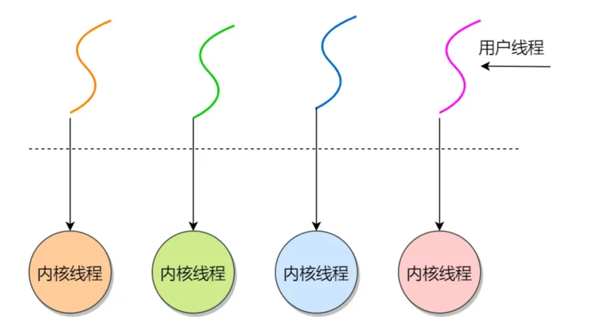

------

### 使用多线程要注意哪些问题？

要保证多线程的程序是安全，不要出现数据竞争造成的数据混乱的问题。

Java的线程安全在三个方面体现：

- **原子性**：提供互斥访问，同一时刻只能有一个线程对数据进行操作，在Java中使用了==atomic==包（这个包提供了一些支持原子操作的类，这些类可以在多线程环境下保证操作的原子性）和==synchronized==关键字来确保原子性；

- **可见性**：一个线程对主内存的修改可以及时地被其他线程看到，在Java中使用了==synchronized==和==volatile==这两个关键字确保可见性；

- **有序性**：一个线程观察其他线程中的指令执行顺序，由于指令重排序，该观察结果一般杂乱无序，在Java中使用了happens-before原则来确保有序性。

  | happens-before 规则                      | JVM 怎么保证？                                               |
  | ---------------------------------------- | ------------------------------------------------------------ |
  | **程序顺序规则**（同一线程内按代码顺序） | 编译器和 CPU **不能重排存在数据依赖的指令**（as-if-serial 语义），保证单线程内逻辑一致。 |
  | **锁（monitor lock）规则**               | `synchronized` 的 **解锁** 操作会插入 **写屏障**（flush 出所有写），**加锁** 操作会插入 **读屏障**（清缓存重新读），确保释放锁前的写对获取锁后的线程可见。 |
  | **volatile 规则**                        | `volatile 写`：编译器在前后插入 `StoreStore` 和 `StoreLoad` 屏障，保证写入主内存、禁止后续指令越过；`volatile 读`：编译器插入 `LoadLoad` 和 `LoadStore`，保证从主内存获取最新值，并禁止前后重排。 |
  | **线程 start/join**                      | `start()` 内部会同步刷新父线程写入的变量，子线程启动时能读到；`join()` 内部通过 **锁/volatile** 确保主线程能看到子线程的所有结果。 |
  | **final 字段规则**                       | 构造函数返回前，JVM 会禁止构造函数内对 `final` 字段写入与 this 引用逃逸之间的重排，确保对象发布后其它线程看不到“半初始化”。 |

  **JMM 定义了规则**（happens-before）。

  **编译器/JVM 负责插入屏障**。

  **CPU 屏障指令保证可见性和顺序性**。

------

### 保证数据的一致性有哪些方案呢？

- **事务管理**：使用数据库事务来确保一组数据库操作要么全部成功提交，要么全部失败回滚。通过ACID（原子性、一致性、隔离性、持久性）属性，数据库事务可以保证数据的一致性。
- **锁机制**：使用锁来实现对共享资源的互斥访问。在 Java 中，可以使用 synchronized 关键字、ReentrantLock 或其他锁机制来控制并发访问，从而避免并发操作导致数据不一致。
- **版本控制**：通过乐观锁的方式，在更新数据时记录数据的版本信息，从而避免同时对同一数据进行修改，进而保证数据的一致性。

------

###  线程的创建方式有哪些?

> 1.继承Thread类

这是最直接的一种方式，用户自定义类继承java.lang.Thread类，重写其run()方法，==run()方法中定义了线程执行的具体任务。创建该类的实例后，通过调用start()方法启动线程==。

```java
class MyThread extends Thread {
    @Override
    public void run() {
        // 线程执行的代码
    }
}

public static void main(String[] args) {
    MyThread t = new MyThread();
    t.start();
}
```

采用继承Thread类方式

- 优点: 编写简单，如果需要访问当前线程，无需使用Thread.currentThread ()方法，直接使用this，即可获得当前线程
- 缺点:因为线程类已经继承了Thread类，所以不能再继承其他的父类

> 2.实现Runnable接口

如果一个类已经继承了其他类，就不能再继承Thread类，此时可以实现java.lang.Runnable接口。实现Runnable接口需要重写run()方法，然后==将此Runnable对象作为参数传递给Thread类的构造器==，创建Thread对象后调用其start()方法启动线程。

```java
class MyRunnable implements Runnable {
    @Override
    public void run() {
        // 线程执行的代码
    }
}

public static void main(String[] args) {
    Thread t = new Thread(new MyRunnable());
    t.start();
}
```

采用实现Runnable接口方式：

- 优点：线程类只是实现了Runable接口，还可以继承其他的类。在这种方式下，可以==多个线程共享同一个目标对象==，所以非常适合多个相同线程来处理同一份资源的情况，从而可以将CPU代码和数据分开，形成清晰的模型，较好地体现了面向对象的思想。
- 缺点：编程稍微复杂，如果需要访问当前线程，必须使用Thread.currentThread()方法。

> 1. 实现Callable接口与FutureTask

java.util.concurrent.Callable接口类似于Runnable，但Callable的call()方法可以有返回值并且可以抛出异常。要执行Callable任务，需将它包装进一个FutureTask，因为Thread类的构造器只接受Runnable参数，而==FutureTask实现了Runnable接口。==

```java
class MyCallable implements Callable<Integer> {
    @Override
    public Integer call() throws Exception {
        // 线程执行的代码，这里返回一个整型结果
        return 1;
    }
}

public static void main(String[] args) {
    MyCallable task = new MyCallable();
    FutureTask<Integer> futureTask = new FutureTask<>(task);
    Thread t = new Thread(futureTask);
    t.start();

    try {
        Integer result = futureTask.get();  // 获取线程执行结果
        System.out.println("Result: " + result);
    } catch (InterruptedException | ExecutionException e) {
        e.printStackTrace();
    }
}
```

采用实现Callable接口方式：

- 缺点：编程稍微复杂，如果需要访问当前线程，必须调用Thread.currentThread()方法。
- 优点：线程只是实现Runnable或实现Callable接口，还可以继承其他类。这种方式下，多个线程可以共享一个target对象，非常适合多线程处理同一份资源的情形。

> 1. 使用线程池（Executor框架）

从Java 5开始引入的java.util.concurrent.ExecutorService和相关类提供了线程池的支持，这是一种更高效的线程管理方式，避免了频繁创建和销毁线程的开销。可以通过Executors类的静态方法创建不同类型的线程池。

```java
class Task implements Runnable {
    @Override
    public void run() {
        // 线程执行的代码
    }
}

public static void main(String[] args) {
    ExecutorService executor = Executors.newFixedThreadPool(10);  // 创建固定大小的线程池
    for (int i = 0; i < 100; i++) {
        executor.submit(new Task());  // 提交任务到线程池执行
    }
    executor.shutdown();  // 关闭线程池
}
```

采用线程池方式：

- 缺点：程池增加了程序的复杂度，特别是当涉及线程池参数调整和故障排查时。错误的配置可能导致死锁、资源耗尽等问题，这些问题的诊断和修复可能较为复杂。
- 优点：线程池可以重用预先创建的线程，避免了线程创建和销毁的开销，显著提高了程序的性能。对于需要快速响应的并发请求，线程池可以迅速提供线程来处理任务，减少等待时间。并且，线程池能够有效控制运行的线程数量，防止因创建过多线程导致的系统资源耗尽（如内存溢出）。通过合理配置线程池大小，可以最大化CPU利用率和系统吞吐量。

------

### 怎么启动线程 ？

- 通过Thread类的**start()。**自动调用的run方法(继承Thread或者实现runnable)，**注意直接调用run方法无法开启线程，只是单纯调用方法** 
- 通过executor的submit/execute方法submit可以传入Runnable或Callable接口，传入Callable接口可以==通过get获取返回值== 而execute只能传入Runable 无法获取返回值

------

### 如何等待线程执行完成

- 普通Thread通过==join==方法等待线程执行完成

- 实现了Callable的Thread通过==get==方法

- executor通过==submit==方法返回Future对象后通过==get==方法

- 通过==CountDownLatch==

  ```java
  CountDownLatch latch = new CountDownLatch(1);
  
  executor.execute(() -> {
      try {
          System.out.println("任务执行");
      } finally {
          latch.countDown(); // 任务完成时释放
      }
  });
  
  latch.await(); // 等待任务完成
  System.out.println("任务完成，继续执行");
  ```

------

### 如何停止一个线程的运行?

主要有这些方法：

1. **interrup()**

   - **异常法停止**：线程调用interrupt()方法后，在线程的run方法中判断当前对象的interrupted()状态，如果是中断状态则抛出异常，达到中断线程的效果。

   - **在沉睡中停止**：先将线程sleep，然后调用interrupt标记中断状态，interrupt会将阻塞状态的线程中断。会抛出中断异常，达到停止线程的效果

     | 线程状态                         | interrupt() 作用                                             | 是否抛异常 |
     | -------------------------------- | ------------------------------------------------------------ | ---------- |
     | 阻塞（sleep/wait/join/阻塞队列） | JVM 检测到中断标志后，会立即抛出 `InterruptedException` 并清除中断状态 | ✅ 抛出     |
     | 运行中 / 普通循环                | 线程仍然执行代码，中断标志被设置，但 JVM 不会抛异常          | ❌ 不抛     |

2. **stop()**

   - **stop()暴力停止**：线程调用stop()方法会被暴力停止，方法已弃用，该方法会有不好的后果：强制让线程停止有可能使一些请理性的工作得不到完成。

3. **Future.cancel()**

   ```java
   public class FutureCancelDemo {
       public static void main(String[] args) {
           ExecutorService executor = Executors.newSingleThreadExecutor();
           Future<?> future = executor.submit(() -> {
               while (!Thread.currentThread().isInterrupted()) {
                   System.out.println("Task running...");
                   try {
                       Thread.sleep(1000);
                   } catch (InterruptedException e) {
                       System.out.println("Task interrupted.");
                       Thread.currentThread().interrupt();
                   }
               }
           });
   
           try {
               Thread.sleep(3000);
               future.cancel(true); // true表示尝试中断任务线程
           } catch (InterruptedException e) {
               Thread.currentThread().interrupt();
           } finally {
               executor.shutdown();
           }
       }
   }
   ```

4. 结合资源关闭操作

   ```java
   public class SocketHandler implements Runnable {
       private ServerSocket serverSocket;
   
       public SocketHandler(ServerSocket serverSocket) {
           this.serverSocket = serverSocket;
       }
   
       @Override
       public void run() {
           try {
               // serverSocket.accept()阻塞时无法响应中断
               while (!Thread.currentThread().isInterrupted()) {
                   Socket socket = serverSocket.accept();
                   // 处理连接...
               }
           } catch (IOException e) {
               if (Thread.currentThread().isInterrupted()) {
                   System.out.println("Thread stopped by interrupt.");
               }
           }
       }
   
       // 特殊关闭方法（销毁资源）
       public void stop() {
           try {
               serverSocket.close(); // 关闭资源使accept()抛出异常
           } catch (IOException e) {
               System.out.println("Error closing socket: " + e);
           }
       }
   }
   ```

每个线程都一个与之关联的布尔属性来表示其中断状态，中断状态的初始值为false，当一个线程被其它线程调用`Thread.interrupt()`方法中断时，会根据实际情况做出响应。

------

### Java线程的状态有哪些？

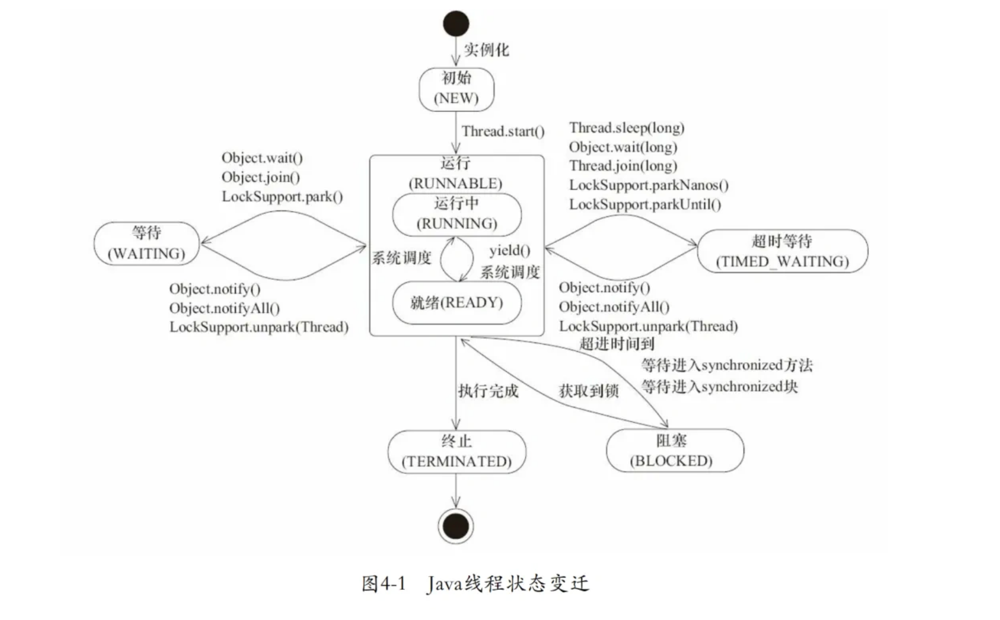

| 线程状态      | 解释                                                         |
| ------------- | ------------------------------------------------------------ |
| NEW           | 尚未启动的线程状态，即线程创建，**还未调用start方法**        |
| RUNNABLE      | **就绪状态**（调用start，等待调度）+**正在运行**             |
| BLOCKED       | **等待监视器锁**时，陷入阻塞状态                             |
| WAITING       | 等待状态的线程正在**等待**另一线程执行特定的操作（如notify） |
| TIMED_WAITING | 具有**指定等待时间**的等待状态                               |
| TERMINATED    | 线程完成执行，**终止状态**                                   |

---

### 多线程wait/notify await/signal

好，我们来详细梳理一下 **`wait`、`notify`、`notifyAll`**（Object 方法）和 **`await`、`signal`、`signalAll`**（`java.util.concurrent.locks.Condition` 方法）在 Java 线程中的使用区别和原理。

------

#### 1. Object 的 wait / notify / notifyAll

##### **1.1 核心概念**

- `wait()`：让当前线程 **进入等待状态**，并 **释放当前对象锁**
- `notify()`：唤醒 **一个正在等待该对象锁的线程**
- `notifyAll()`：唤醒 **所有等待该对象锁的线程**

> 注意：这三个方法必须在 **同步块或同步方法** 中调用，否则会抛 `IllegalMonitorStateException`。

------

##### **1.2 基本用法示例（生产者-消费者）**

```java
class Resource {
    private int data;
    private boolean hasData = false;

    public synchronized void produce(int value) throws InterruptedException {
        while (hasData) {
            wait(); // 等待消费者消费
        }
        data = value;
        hasData = true;
        System.out.println("生产: " + data);
        notify(); // 唤醒消费者
    }

    public synchronized int consume() throws InterruptedException {
        while (!hasData) {
            wait(); // 等待生产者生产
        }
        hasData = false;
        System.out.println("消费: " + data);
        notify(); // 唤醒生产者
        return data;
    }
}

public class Demo {
    public static void main(String[] args) {
        Resource r = new Resource();

        new Thread(() -> {
            try {
                for (int i = 0; i < 5; i++) r.produce(i);
            } catch (InterruptedException e) {}
        }).start();

        new Thread(() -> {
            try {
                for (int i = 0; i < 5; i++) r.consume();
            } catch (InterruptedException e) {}
        }).start();
    }
}
```

- `wait()` 会 **释放锁并挂起线程**
- `notify()` 会 **唤醒一个等待线程**，但它必须等到 **当前同步块退出** 才能拿到锁执行

------

#### 2. Lock + Condition 的 await / signal / signalAll

`java.util.concurrent.locks.Condition` 是 **Lock 的增强版**，功能和 Object 的 wait/notify 类似，但更灵活。

##### **2.1 核心方法**

| 方法          | 功能                   |
| ------------- | ---------------------- |
| `await()`     | 当前线程等待，并释放锁 |
| `signal()`    | 唤醒一个等待的线程     |
| `signalAll()` | 唤醒所有等待的线程     |

> 需要配合 `Lock` 使用，而不是 `synchronized`

------

##### **2.2 使用示例**

```java
import java.util.concurrent.locks.Condition;
import java.util.concurrent.locks.ReentrantLock;

class Resource {
    private int data;
    private boolean hasData = false;
    private final ReentrantLock lock = new ReentrantLock();
    private final Condition condition = lock.newCondition();

    public void produce(int value) throws InterruptedException {
        lock.lock();
        try {
            while (hasData) {
                condition.await(); // 等待消费者
            }
            data = value;
            hasData = true;
            System.out.println("生产: " + data);
            condition.signal(); // 唤醒消费者
        } finally {
            lock.unlock();
        }
    }

    public int consume() throws InterruptedException {
        lock.lock();
        try {
            while (!hasData) {
                condition.await(); // 等待生产者
            }
            hasData = false;
            System.out.println("消费: " + data);
            condition.signal(); // 唤醒生产者
            return data;
        } finally {
            lock.unlock();
        }
    }
}
```

- 相比 `synchronized + wait/notify`：
  - `Condition` 可以有多个条件队列
  - `await()` 可以响应中断 (`InterruptedException`)
  - 更加灵活，可精细控制唤醒策略

------

#### 核心注意点

1. **wait/notify 必须在同步块内调用**
2. **await/signal 必须在 lock.lock() / unlock() 内调用**
3. **wait / await 会释放锁，notify / signal 不释放锁**
4. **唤醒线程后，线程会先尝试重新获取锁**，才能继续执行

------

✅ **总结**

| 机制             | 阻塞方法 | 唤醒方法             | 锁机制        | 特点                             |
| ---------------- | -------- | -------------------- | ------------- | -------------------------------- |
| Object           | wait()   | notify()/notifyAll() | synchronized  | 简单，锁和条件绑定在对象上       |
| Lock + Condition | await()  | signal()/signalAll() | ReentrantLock | 灵活，可多个条件队列，可响应中断 |

> 简单理解：
>
> - `wait` / `await` → **挂起并释放锁**
> - `notify` / `signal` → **唤醒线程，等待锁可用后执行**

------

==多用于消息队列==

------

### sleep 和 wait的区别是什么？

| **特性** | `sleep()`                  | `wait()`                           |
| -------- | -------------------------- | ---------------------------------- |
| 所属类   | `Thread` 类（静态方法）    | `Object` 类（实例方法）            |
| 锁释放   | ❌                          | ✅                                  |
| 使用前提 | 任意位置调用               | ==必须在同步块内（持有锁）==       |
| 唤醒机制 | 超时自动恢复               | 需 `notify()`/`notifyAll()` 或超时 |
| 设计用途 | 暂停线程执行，不涉及锁协作 | 线程间协调，释放锁让其他线程工作   |

- **所属分类的不同**：sleep 是 `Thread` 类的静态方法，可以在任何地方直接通过 `Thread.sleep()` 调用，无需依赖对象实例。wait 是 `Object` 类的实例方法，这意味着必须通过对象实例来调用。
- **锁释放的情况**：`Thread.sleep()` 在调用时，线程会暂停执行指定的时间，但不会释放持有的对象锁。也就是说，在 `sleep` 期间，其他线程无法获得该线程持有的锁。`Object.wait()`：调用该方法时，线程会释放持有的对象锁，进入等待状态，直到其他线程调用相同对象的 `notify()` 或 `notifyAll()` 方法唤醒它
- **使用条件**：sleep 可在任意位置调用，无需事先获取锁。 wait 必须在同步块或同步方法内调用（即线程需持有该对象的锁），否则抛出 `IllegalMonitorStateException`。
- **唤醒机制**：sleep 休眠时间结束后，线程 自动恢复 到就绪状态，等待CPU调度。wait 需要其他线程调用相同对象的 `notify()` 或 `notifyAll()` 方法才能被唤醒。`notify()` 会随机唤醒一个在该对象上等待的线程，而 `notifyAll()` 会唤醒所有在该对象上等待的线程。

------

### sleep会释放cpu吗？

是的，调用 `Thread.sleep()` 时，==线程会释放 CPU==，但不会释放持有的锁。

**当线程调用** `sleep()` **后，会主动让出 CPU 时间片**，进入 `TIMED_WAITING` 状态。此时操作系统会触发调度，将 CPU 分配给其他处于就绪状态的线程。这样其他线程（无论是需要同一锁的线程还是不相关线程）便有机会执行。

`sleep()` 不会释放线程已持有的任何锁（如 `synchronized` 同步代码块或方法中获取的锁）。因此，如果有其他线程试图获取同一把锁，它们仍会被阻塞，直到原线程退出同步代码块。

------

### blocked和waiting有啥区别

区别如下：

- **触发条件**:线程进入BLOCKED状态通常是因为试图获取一个对象的锁（monitor lock），==但该锁已经被另一个线程持有==。这通常发生在尝试进入synchronized块或方法时，如果锁已被占用，则线程将被阻塞直到锁可用。线程进入WAITING状态是因为它正在等待另一个线程执行某些操作，例如调用==Object.wait()方法、Thread.join()方法或LockSupport.park()方法==。在这种状态下，线程将不会消耗CPU资源，并且不会参与锁的竞争。


- **唤醒机制**:当一个线程被阻塞等待锁时，一旦锁被释放，线程将有机会重新尝试获取锁。如果锁此时未被其他线程获取，那么==线程可以从BLOCKED状态变为RUNNABLE状态==。线程在WAITING状态中需要被显式唤醒。例如，如果线程调用了Object.wait()，那么它必须等待另一个线程调用同一对象上的Object.notify()或Object.notifyAll()方法才能被唤醒。

所以，BLOCKED和WAITING两个状态最大的区别有两个：

- BLOCKED是锁竞争失败后被被动触发的状态，WAITING是人为的主动触发的状态
- BLCKED的唤醒时自动触发的，而WAITING状态是必须要通过特定的方法来主动唤醒

------

### notify 选择哪个线程?

notify在源码的注释中说到notify选择唤醒的线程是==任意的==，但是依赖于具体实现的jvm。


JVM有很多实现，比较流行的就是==hotspot==，hotspot对notofy()的实现并不是我们以为的随机唤醒,，而是“先进先出”的顺序唤醒。

------

### 线程间通信方式有哪些？

1、Object 类的 wait()、notify() 和 notifyAll() 方法。这是 Java 中最基础的线程间通信方式，基于对象的监视器（锁）机制。

- `wait()`：使当前线程进入等待状态，直到其他线程调用该对象的 `notify()` 或 `notifyAll()` 方法。
- `notify()`：唤醒在此对象监视器上等待的单个线程。
- `notifyAll()`：唤醒在此对象监视器上等待的所有线程。

```java
class SharedObject {
    public synchronized void consumerMethod() throws InterruptedException {
        while (/* 条件不满足 */) {
            wait();
        }
        // 执行相应操作
    }

    public synchronized void producerMethod() {
        // 执行相应操作
        notify(); // 或者 notifyAll()
    }
}
```

2、`Lock` 和 `Condition` 接口。`Lock` 接口提供了比 `synchronized` 更灵活的锁机制，`Condition` 接口则配合 `Lock` 实现线程间的等待 / 通知机制。

- `await()`：使当前线程进入等待状态，直到被其他线程唤醒。
- `signal()`：唤醒一个等待在该 `Condition` 上的线程。
- `signalAll()`：唤醒所有等待在该 `Condition` 上的线程。

```java
import java.util.concurrent.locks.Condition;
import java.util.concurrent.locks.Lock;
import java.util.concurrent.locks.ReentrantLock;

class SharedResource {
    private final Lock lock = new ReentrantLock();
    private final Condition condition = lock.newCondition();

    public void consumer() throws InterruptedException {
        lock.lock();
        try {
            while (/* 条件不满足 */) {
                condition.await();
            }
            // 执行相应操作
        } finally {
            lock.unlock();
        }
    }

    public void producer() {
        lock.lock();
        try {
            // 执行相应操作
            condition.signal(); // 或者 signalAll()
        } finally {
            lock.unlock();
        }
    }
}
```

3、`volatile` 关键字。`volatile` 关键字用于保证变量的可见性，即当一个变量被声明为 `volatile` 时，它会保证对该变量的写操作会立即刷新到主内存中，而读操作会从主内存中读取最新的值。

```java
class VolatileExample {
    private volatile boolean flag = false;

    public void writer() {
        flag = true;
    }

    public void reader() {
        while (!flag) {
            // 等待
        }
        // 执行相应操作
    }
}
```

4、**CountDownLatch**。`CountDownLatch` 是一个同步辅助类，它允许一个或多个线程等待其他线程完成操作。

- `CountDownLatch(int count)`：构造函数，指定需要等待的线程数量。
- `countDown()`：减少计数器的值。
- `await()`：使当前线程等待，直到计数器的值为 0。

```java
import java.util.concurrent.CountDownLatch;

public class CountDownLatchExample {
    public static void main(String[] args) throws InterruptedException {
        int threadCount = 3;
        CountDownLatch latch = new CountDownLatch(threadCount);

        for (int i = 0; i < threadCount; i++) {
            new Thread(() -> {
                try {
                    // 执行任务
                    System.out.println(Thread.currentThread().getName() + " 完成任务");
                } finally {
                    latch.countDown();
                }
            }).start();
        }

        latch.await();
        System.out.println("所有线程任务完成");
    }
}
```

5、**CyclicBarrier**。`CyclicBarrier` 是一个同步辅助类，它允许一组线程相互等待，直到所有线程都到达某个公共屏障点。

- `CyclicBarrier(int parties, Runnable barrierAction)`：构造函数，指定参与的线程数量和所有线程到达屏障点后要执行的操作。
- `await()`：使当前线程等待，直到所有线程都到达屏障点。

```java
import java.util.concurrent.CyclicBarrier;

public class CyclicBarrierExample {
    public static void main(String[] args) {
        int threadCount = 3;
        CyclicBarrier barrier = new CyclicBarrier(threadCount, () -> {
            System.out.println("所有线程都到达屏障点");
        });

        for (int i = 0; i < threadCount; i++) {
            new Thread(() -> {
                try {
                    // 执行任务
                    System.out.println(Thread.currentThread().getName() + " 到达屏障点");
                    barrier.await();
                    // 继续执行后续任务
                } catch (Exception e) {
                    e.printStackTrace();
                }
            }).start();
        }
    }
}
```

> 每个线程打印“到达屏障点”
>
> 调用 `barrier.await()` → 阻塞
>
> 当第 3 个线程也调用 `await()` 时，屏障被触发：
>
> - 先执行 barrier action（打印 `"所有线程都到达屏障点"`）
> - 然后唤醒所有等待的线程
>
> 线程恢复执行“后续任务”部分（这里你没有写任何代码）

6、**Semaphore**。`Semaphore` 是一个计数信号量，它可以控制同时访问特定资源的线程数量。

- `Semaphore(int permits)`：构造函数，指定信号量的初始许可数量。
- `acquire()`：获取一个许可，如果没有可用许可则阻塞。
- `release()`：释放一个许可。

```java
import java.util.concurrent.Semaphore;

public class SemaphoreExample {
    public static void main(String[] args) {
        int permitCount = 2;
        Semaphore semaphore = new Semaphore(permitCount);

        for (int i = 0; i < 5; i++) {
            new Thread(() -> {
                try {
                    semaphore.acquire();
                    System.out.println(Thread.currentThread().getName() + " 获得许可");
                    // 执行任务
                    Thread.sleep(1000);
                } catch (InterruptedException e) {
                    e.printStackTrace();
                } finally {
                    semaphore.release();
                    System.out.println(Thread.currentThread().getName() + " 释放许可");
                }
            }).start();
        }
    }
}
```

> 线程启动时 `acquire()`：
>
> - 前 2 个线程能直接拿到许可，不阻塞。
> - 第 3、4、5 个线程会阻塞等待。
>
> 当有线程 `release()`：
>
> - 计数器 +1 → 如果有阻塞线程，就唤醒一个。
> - 被唤醒的线程重新尝试 `acquire()`，拿到许可继续执行。

------

## 并发安全

### juc包下你常用的类？

线程池相关：

- `ThreadPoolExecutor`：最核心的线程池类，用于创建和管理线程池。通过它可以灵活地配置线程池的参数，如核心线程数、最大线程数、任务队列等，以满足不同的并发处理需求。
- `Executors`：线程池工厂类，提供了一系列静态方法来创建不同类型的线程池，如`newFixedThreadPool`（创建固定线程数的线程池）、`newCachedThreadPool`（创建可缓存线程池）、`newSingleThreadExecutor`（创建单线程线程池）等，方便开发者快速创建线程池。

并发集合类：

- `ConcurrentHashMap`：线程安全的哈希映射表，用于在多线程环境下高效地存储和访问键值对。它采用了分段锁等技术，允许多个线程同时访问不同的段，提高了并发性能，在高并发场景下比传统的`Hashtable`性能更好。
- `CopyOnWriteArrayList`：线程安全的列表，在对列表进行修改操作时，会创建一个新的底层数组，将修改操作应用到新数组上，而读操作仍然可以在旧数组上进行，从而实现了读写分离，提高了并发读的性能，适用于读多写少的场景。

同步工具类：

- `CountDownLatch`：允许一个或多个线程等待其他一组线程完成操作后再继续执行。它通过一个计数器来实现，计数器初始化为线程的数量，每个线程完成任务后调用`countDown`方法将计数器减一，当计数器为零时，等待的线程可以继续执行。常用于多个线程完成各自任务后，再进行汇总或下一步操作的场景。
- `CyclicBarrier`：让一组线程互相等待，直到所有线程都到达某个屏障点后，再一起继续执行。与`CountDownLatch`不同的是，`CyclicBarrier`可以重复使用，当所有线程都通过屏障后，计数器会重置，可以再次用于下一轮的等待。适用于多个线程需要协同工作，在某个阶段完成后再一起进入下一个阶段的场景。
- `Semaphore`：信号量，用于控制同时访问某个资源的线程数量。它维护了一个许可计数器，线程在访问资源前需要获取许可，如果有可用许可，则获取成功并将许可计数器减一，否则线程需要等待，直到有其他线程释放许可。常用于控制对有限资源的访问，如数据库连接池、线程池中的线程数量等。

原子类：

- `AtomicInteger`：原子整数类，提供了对整数类型的原子操作，如自增、自减、比较并交换等。通过硬件级别的原子指令来保证操作的原子性和线程安全性，避免了使用锁带来的性能开销，在多线程环境下对整数进行计数、状态标记等操作非常方便。
- `AtomicReference`：原子引用类，用于对对象引用进行原子操作。可以保证在多线程环境下，对对象的更新操作是原子性的，即要么全部成功，要么全部失败，不会出现数据不一致的情况。常用于实现无锁数据结构或需要对对象进行原子更新的场景。

------

### Java中有哪些常用的锁，在什么场景下使用？

Java中的锁是用于管理多线程并发访问共享资源的关键机制。锁可以确保在任意给定时间内只有一个线程可以访问特定的资源，从而避免数据竞争和不一致性。Java提供了多种锁机制，可以分为以下几类：

- **内置锁（synchronized）**：Java中的`synchronized`关键字是内置锁机制的基础，可以用于方法或代码块。当一个线程进入`synchronized`代码块或方法时，它会获取关联对象的锁；当线程离开该代码块或方法时，锁会被释放。如果其他线程尝试获取同一个对象的锁，它们将被阻塞，直到锁被释放。其中，syncronized加锁时有无锁、偏向锁、轻量级锁和重量级锁几个级别。偏向锁用于当一个线程进入同步块时，如果没有任何其他线程竞争，就会使用偏向锁，以减少锁的开销。轻量级锁使用线程栈上的数据结构，避免了操作系统级别的锁。重量级锁则涉及操作系统级的互斥锁。
- **ReentrantLock**：`java.util.concurrent.locks.ReentrantLock`是一个显式的锁类，提供了比`synchronized`更高级的功能，如可中断的锁等待、定时锁等待、公平锁选项等。`ReentrantLock`使用`lock()`和`unlock()`方法来获取和释放锁。其中，公平锁按照线程请求锁的顺序来分配锁，保证了锁分配的公平性，但可能增加锁的等待时间。非公平锁不保证锁分配的顺序，可以减少锁的竞争，提高性能，但可能造成某些线程的饥饿。
- **读写锁（ReadWriteLock）**：`java.util.concurrent.locks.ReadWriteLock`接口定义了一种锁，允许多个读取者同时访问共享资源，但只允许一个写入者。读写锁通常用于读取远多于写入的情况，以提高并发性。
- **乐观锁和悲观锁**：悲观锁（Pessimistic Locking）通常指在访问数据前就锁定资源，假设最坏的情况，即数据很可能被其他线程修改。`synchronized`和`ReentrantLock`都是悲观锁的例子。乐观锁（Optimistic Locking）通常不锁定资源，而是在更新数据时检查数据是否已被其他线程修改。乐观锁常使用版本号或时间戳来实现。
- **自旋锁**：自旋锁是一种锁机制，线程在等待锁时会持续循环检查锁是否可用，而不是放弃CPU并阻塞。通常可以使用CAS来实现。这在锁等待时间很短的情况下可以提高性能，但过度自旋会浪费CPU资源。

---

### synchronized和reentrantlock及其应用场景？

> synchronized 工作原理

synchronized是Java提供的原子性==内置锁==，这种内置的并且使用者看不到的锁也被称为**监视器锁**，

使用synchronized之后，会在编译之后在同步的代码块前后加上==monitorenter==和==monitorexit==字节码指令，他==依赖操作系统底层互斥锁实现==。他的作用主要就是实现原子性操作和解决共享变量的内存可见性问题。

执行monitorenter指令时会尝试获取对象锁，如果对象没有被锁定或者已经获得了锁，锁的计数器+1。此时其他竞争锁的线程则会进入等待队列中。执行monitorexit指令时则会把计数器-1，当计数器值为0时，则锁释放，处于等待队列中的线程再继续竞争锁。

synchronized是排它锁，当一个线程获得锁之后，其他线程必须等待该线程释放锁后才能获得锁，而且由于Java中的线程和操作系统原生线程是一一对应的，==线程被阻塞或者唤醒时时会从用户态切换到内核态，这种转换非常消耗性能。==

从内存语义来说，==加锁的过程会清除工作内存中的共享变量，再从主内存读取，而释放锁的过程则是将工作内存中的共享变量写回主内存。==

实际上大部分时候我认为说到monitorenter就行了，但是为了更清楚的描述，还是再具体一点。

如果再深入到源码来说，synchronized实际上有两个队列==waitSet和entryList==。

1. 当多个线程进入同步代码块时，首先进入entryList
2. 有一个线程获取到monitor锁后，就赋值给当前线程，并且计数器+1
3. 如果线程调用wait方法，将释放锁，当前线程置为null，计数器-1，同时进入waitSet等待被唤醒，调用notify或者notifyAll之后又会进入entryList竞争锁
4. 如果线程执行完毕，同样释放锁，计数器-1，当前线程置为null

> reentrantlock工作原理

ReentrantLock 的底层实现主要依赖于 ==AbstractQueuedSynchronizer（AQS）==这个抽象类。AQS 是一个提供了基本同步机制的框架，其中包括了队列、状态值等。

ReentrantLock 在 AQS 的基础上通过内部类 ==Sync== 来实现具体的锁操作。不同的 Sync 子类实现了公平锁和非公平锁的不同逻辑：

- **可中断性**： ReentrantLock 实现了可中断性，这意味着线程在等待锁的过程中，可以被其他线程中断而提前结束等待。在底层，ReentrantLock 使用了与 LockSupport.park() 和 LockSupport.unpark() 相关的机制来实现可中断性。
- **设置超时时间**： ReentrantLock 支持在尝试获取锁时设置超时时间，即等待一定时间后如果还未获得锁，则放弃锁的获取。这是通过内部的 ==tryAcquireNanos== 方法来实现的。
- **公平锁和非公平锁**： 在直接创建 ReentrantLock 对象时，==默认情况下是非公平锁==。公平锁是按照线程等待的顺序来获取锁，而非公平锁则允许多个线程在同一时刻竞争锁，不考虑它们申请锁的顺序。公平锁可以通过在创建 ReentrantLock 时传入 true 来设置，例如：

```java
ReentrantLock fairLock = new ReentrantLock(true);
```

- **多个条件变量**： ReentrantLock 支持多个条件变量，每个条件变量可以与一个 ReentrantLock 关联。这使得线程可以更灵活地进行等待和唤醒操作，而不仅仅是基于对象监视器的 wait() 和 notify()。多个条件变量的实现依赖于 Condition 接口，例如：

```java
ReentrantLock lock = new ReentrantLock();
Condition condition = lock.newCondition();
// 使用下面方法进行等待和唤醒
condition.await();
condition.signal();
```

- **可重入性**： ReentrantLock 支持可重入性，==即同一个线程可以多次获得同一把锁，**支持递归调用而不会造成死锁**==。这是通过内部的 ==holdCount== 计数来实现的。当一个线程多次获取锁时，holdCount 递增，释放锁时递减，只有当 holdCount 为零时，其他线程才有机会获取锁。

> 应用场景的区别

**synchronized**：

- **简单同步需求**： 当你需要对代码块或方法进行简单的同步控制时，`synchronized`是一个很好的选择。它使用起来简单，不需要额外的资源管理，因为锁会在方法退出或代码块执行完毕后自动释放。
- **代码块同步**： 如果你想对特定代码段进行同步，而不是整个方法，可以使用`synchronized`代码块。这可以让你更精细地控制同步的范围，从而减少锁的持有时间，提高并发性能。
- **内置锁的使用**： `synchronized`关键字使用对象的内置锁（也称为监视器锁），这在需要使用对象作为锁对象的情况下很有用，尤其是在对象状态与锁保护的代码紧密相关时。

**ReentrantLock：**

- **高级锁功能需求**： `ReentrantLock`提供了`synchronized`所不具备的高级功能，==如公平锁、响应中断、定时锁尝试、以及多个条件变量==。当你需要这些功能时，`ReentrantLock`是更好的选择。
- **性能优化**： 在高度竞争的环境中，`ReentrantLock`可以提供比`synchronized`更好的性能，因为它提供了更细粒度的控制，如尝试锁定和定时锁定，可以减少线程阻塞的可能性。
- **复杂同步结构**： 当你需要更复杂的同步结构，如需要多个条件变量来协调线程之间的通信时，`ReentrantLock`及其配套的`Condition`对象可以提供更灵活的解决方案。

综上，`synchronized`适用于简单同步需求和不需要额外锁功能的场景，而`ReentrantLock`适用于需要更高级锁功能、性能优化或复杂同步逻辑的情况。选择哪种同步机制取决于具体的应用需求和性能考虑。

---

### 怎么理解可重入锁？

可重入锁是指==同一个线程在获取了锁之后，可以再次重复获取该锁而不会造成死锁或其他问题==。当一个线程持有锁时，如果再次尝试获取该锁，就会成功获取而不会被阻塞。

ReentrantLock实现可重入锁的机制是基于线程持有锁的==计数器==。

- 当一个线程第一次获取锁时，计数器会加1，表示该线程持有了锁。在此之后，如果同一个线程再次获取锁，计数器会再次加1。每次线程成功获取锁时，都会将计数器加1。
- 当线程释放锁时，计数器会相应地减1。==只有当计数器减到0时，锁才会完全释放==，其他线程才有机会获取锁。

这种计数器的设计使得同一个线程可以多次获取同一个锁，而不会造成死锁或其他问题。每次获取锁时，计数器加1；每次释放锁时，计数器减1。只有当计数器减到0时，锁才会完全释放。

ReentrantLock通过这种计数器的方式，实现了可重入锁的机制。它允许同一个线程多次获取同一个锁，并且能够正确地处理锁的获取和释放，避免了死锁和其他并发问题。

---

### synchronized 支持重入吗？如何实现的?

synchronized是基于原子性的内部锁机制，是可重入的，因此==在一个线程调用synchronized方法的同时在其方法体内部调用该对象另一个synchronized方法==，也就是说一个线程得到一个对象锁后再次请求该对象锁，是允许的，这就是synchronized的可重入性。

synchronized底层是利用计算机系统mutex Lock实现的。每一个可重入锁都会关联一个线程ID和一个锁状态status。

当一个线程请求方法时，会去检查锁状态。

1. 如果锁状态是0，代表该锁没有被占用，使用CAS操作获取锁，将线程ID替换成自己的线程ID。
2. 如果锁状态不是0，代表有线程在访问该方法。此时，如果线程ID是自己的线程ID，如果是可重入锁，会将==status自增1，然后获取到该锁==，进而执行相应的方法；如果是非重入锁，就会进入阻塞队列等待。

在释放锁时，

1. 如果是可重入锁的，每一次退出方法，就会将status减1，直至status的值为0，最后释放该锁。
2. 如果非可重入锁的，线程退出方法，直接就会释放该锁。

---

### syncronized锁升级的过程讲一下

具体的锁升级的过程是：**无锁->偏向锁->轻量级锁->重量级锁**。

- **无锁**：这是没有开启偏向锁的时候的状态，在JDK1.6之后偏向锁的默认开启的，但是有一个偏向延迟，需要在JVM启动之后的多少秒之后才能开启，这个可以通过JVM参数进行设置，同时是否开启偏向锁也可以通过JVM参数设置。
- **偏向锁**：这个是在偏向锁开启之后的锁的状态，如果还没有一个线程拿到这个锁的话，这个状态叫做==匿名偏向==，当一个线程拿到偏向锁的时候，下次想要竞争锁只需要拿线程==ID跟MarkWord当中存储的线程ID进行比较==，如果线程ID相同则直接获取锁（==相当于锁偏向于这个线程==），不需要进行CAS操作和将线程挂起的操作。
- **轻量级锁**：在这个状态下线程主要是通过CAS操作实现的。将对象的MarkWord存储到线程的虚拟机栈上，然后通过CAS将对象的MarkWord的内容设置为指向Displaced Mark Word的指针，如果设置成功则获取锁。在线程出临界区的时候，也需要使用CAS，如果使用CAS替换成功则同步成功，如果失败表示有其他线程在获取锁，那么就需要在释放锁之后将被挂起的线程唤醒。==简单来说：尝试看一下线程A持有锁是否结束  结束了就把锁给B==
- **重量级锁**：当==有两个以上的线程获取锁的时候==轻量级锁就会升级为重量级锁，因为CAS如果没有成功的话始终都在自旋，进行while循环操作，这是非常消耗CPU的，但是在升级为重量级锁之后，线程会被操作系统调度然后挂起，这可以节约CPU资源。

了解完 4 种锁状态之后，我们就可以整体的来看一下锁升级的过程了。  线程A进入 synchronized 开始抢锁，JVM 会判断当前是否是偏向锁的状态，如果是就会根据 Mark Word 中存储的线程 ID 来判断，当前线程A是否就是持有偏向锁的线程。如果是，则忽略 check，线程A直接执行临界区内的代码。

但如果 Mark Word 里的线程不是线程 A，就会通过自旋尝试获取锁，如果获取到了，就将 Mark Word 中的线程 ID 改为自己的;如果竞争失败，就会立马撤销偏向锁，膨胀为轻量级锁。

后续的竞争线程都会通过自旋来尝试获取锁，如果自旋成功那么锁的状态仍然是轻量级锁。然而如果竞争失败，锁会膨胀为重量级锁，后续等待的竞争的线程都会被阻塞。

---

###  JVM对Synchornized的优化？

synchronized 核心优化方案主要包含以下 4 个：

- **锁膨胀**：==synchronized 从无锁升级到偏向锁，再到轻量级锁，最后到重量级锁的过程，它叫做锁膨胀也叫做锁升级==。**JDK 1.6 之前，synchronized 是重量级锁**，也就是说 synchronized 在释放和获取锁时**都会从用户态转换成内核态，而转换的效率是比较低的**。但有了锁膨胀机制之后，synchronized 的状态就多了无锁、偏向锁以及轻量级锁了，这时候在进行并发操作时，大部分的场景都不需要用户态到内核态的转换了，这样就大幅的提升了 synchronized 的性能。
- **锁消除**：指的是在某些情况下，JVM 虚拟机如果==检测不到某段代码被共享和竞争的可能性==，就会将这段代码所属的==同步锁消除掉==，从而到底提高程序性能的目的。
- **锁粗化**：将多个连续的加锁、解锁操作连接在一起，==扩展==成一个范围更大的锁。
- **自适应自旋锁**：指通过自身循环，尝试获取锁的一种方式，优点在于它避免一些线程的挂起和恢复操作，因为挂起线程和恢复线程都需要从用户态转入内核态，这个过程是比较慢的，所以通过自旋的方式可以一定程度上避免线程挂起和恢复所造成的性能开销。

---

### 介绍一下AQS

AQS全称为==AbstractQueuedSynchronizer==，是Java中的一个抽象类。 AQS是一个用于构建锁、同步器、协作工具类的==工具类==（框架）。

AQS核心思想是，如果被请求的共享资源空闲，那么就将当前请求资源的线程设置为有效的工作线程，将共享资源设置为锁定状态；如果共享资源被占用，就需要一定的阻塞等待唤醒机制来保证锁分配。这个机制主要用的是==CLH队列的变体==实现的，将暂时获取不到锁的线程加入到队列中。

CLH：Craig、Landin and Hagersten队列，是单向链表，AQS中的队列是CLH变体的==虚拟双向队列（FIFO）==，AQS是通过将每条请求共享资源的线程封装成一个节点来实现锁的分配。

主要原理图如下： 

AQS使用一个Volatile的int类型的成员变量来表示同步状态，通过内置的FIFO队列来完成资源获取的排队工作，==通过CAS==完成对State值的修改。

AQS广泛用于控制并发流程的类，如下图：


其中`Sync`是这些类中都有的内部类，其结构如下：


可以看到：==`Sync`是`AQS`的实现==。 `AQS`主要完成的任务：

- 同步状态（比如说计数器）的原子性管理；
- 线程的阻塞和解除阻塞；
- 队列的管理。

==**AQS**：提供队列、阻塞、唤醒机制==

==**Sync**：具体实现锁的获取/释放规则==

> AQS原理

AQS最核心的就是三大部分：

- 状态：state；
- 控制线程抢锁和配合的FIFO队列（双向链表）；
- 期望协作工具类去实现的获取/释放等重要方法（重写）。

**状态state**

- 这里state的具体含义，会根据具体实现类的不同而不同：比如在Semapore里，他表示剩余许可证的数量；在CountDownLatch里，它表示还需要倒数的数量；在ReentrantLock中，state用来表示“锁”的占有情况，包括可重入计数，当state的值为0的时候，标识该Lock不被任何线程所占有。
- state是volatile修饰的，并被并发修改，所以修改state的方法都需要保证线程安全，比如getState、setState以及compareAndSetState操作来读取和更新这个状态。这些方法都依赖于unsafe类。

**FIFO队列**

- 这个队列用来存放“等待的线程，AQS就是“排队管理器”，当多个线程争用同一把锁时，必须有排队机制将那些没能拿到锁的线程串在一起。当锁释放时，锁管理器就会挑选一个合适的线程来占有这个刚刚释放的锁。
- AQS会维护一个等待的线程队列，把线程都放到这个队列里，这个队列是双向链表形式。

```
在 ReentrantLock 的 非公平模式 下：

释放锁 → state 设置为 0

新来的线程会立即 CAS 尝试获取锁

成功：新线程直接获得锁（插队成功）

失败：才会唤醒队列中的下一个线程
```

优先插队 避免频繁唤醒队列 

==线程在 `tryAcquire` 失败时会被 **加入 AQS 的队列**==

==随后调用 `LockSupport.park()` → 线程就会 **进入操作系统的阻塞状态**（内核挂起，用户态线程不再消耗 CPU）==

**实现获取/释放等方法**

- 这里的获取和释放方法，是利用AQS的协作工具类里最重要的方法，是由协作类自己去实现的，并且含义各不相同；
- 获取方法：获取操作会以来state变量，经常会阻塞（比如获取不到锁的时候）。在Semaphore中，获取就是acquire方法，作用是获取一个许可证； 而在CountDownLatch里面，获取就是await方法，作用是等待，直到倒数结束；
- 释放方法：在Semaphore中，释放就是release方法，作用是释放一个许可证； 在CountDownLatch里面，获取就是countDown方法，作用是将倒数的数减一；
- 需要每个实现类重写tryAcquire和tryRelease等方法。

####  总结关系

- **AQS** = 框架（提供 state + 队列 + 模板方法）
- **Sync** = AQS 的具体子类（决定工具类的语义，比如锁、信号量、倒计时器）
- **工具类（如 ReentrantLock）** = 封装 Sync，提供用户友好的 API

---

### CAS 和 AQS 有什么关系？

CAS 和 AQS 两者的区别：

- CAS 是一种乐观锁机制，它包含三个操作数：内存位置（V）、预期值（A）和新值（B）。==CAS 操作的逻辑是，如果内存位置 V 的值等于预期值 A，则将其更新为新值 B==，否则不做任何操作。整个过程是==原子性==的，通常==由硬件指令支持==，如在现代处理器上，`cmpxchg` 指令可以实现 CAS 操作。
- AQS 是一个用于构建锁和同步器的==框架==，许多同步器如 `ReentrantLock`、`Semaphore`、`CountDownLatch` 等都是基于 AQS 构建的。AQS 使用一个 `volatile` 的整数变量 `state` 来表示同步状态，通过内置的 `FIFO` 队列来管理等待线程。它提供了一些基本的操作，如 `acquire`（获取资源）和 `release`（释放资源），这些操作会修改 `state` 的值，并根据 `state` 的值来判断线程是否可以获取或释放资源。AQS 的 `acquire` 操作通常会先尝试获取资源，如果失败，线程将被添加到等待队列中，并阻塞等待。`release` 操作会释放资源，并唤醒等待队列中的线程。

CAS 和 AQS 两者的联系：

- **==CAS 为 AQS 提供原子操作支持==**：AQS 内部使用 CAS 操作来更新 `state` 变量，以实现线程安全的状态修改。在 `acquire` 操作中，当线程尝试获取资源时，会使用 CAS 操作尝试将 `state` 从一个值更新为另一个值，如果更新失败，说明资源已被占用，线程会进入等待队列。在 `release` 操作中，当线程释放资源时，也会使用 CAS 操作将 `state` 恢复到相应的值，以保证状态更新的原子性。

------

### Threadlocal作用，原理，具体里面存的key value是啥，会有什么问题，如何解决?

`ThreadLocal`是Java中用于解决线程安全问题的一种机制，它允许创建线程局部变量，即每个线程都有自己独立的变量副本，从而避免了线程间的资源共享和同步问题。


从内存结构图，我们可以看到：

- Thread类中，有个ThreadLocal.ThreadLocalMap 的成员变量。
- ==ThreadLocalMap内部维护了Entry数组，每个Entry代表一个完整的对象，key**是**ThreadLocal**本身**，value是ThreadLocal的泛型对象值。==

```
Thread T1
  └── ThreadLocalMap
         ├── Entry(key=local1, value="Hello")
         └── Entry(key=local2, value=123)
```

```java
    public void set(T value) {
        Thread t = Thread.currentThread();
        ThreadLocalMap map = getMap(t);
        if (map != null) {
            map.set(this, value);
        } else {
            createMap(t, value);
        }
    }
```

> ThreadLocal的作用

- **线程隔离**：`ThreadLocal`为每个线程提供了独立的变量副本，这意味着线程之间不会相互影响，可以安全地在多线程环境中使用这些变量而不必担心数据竞争或同步问题。
- **降低耦合度**：在同一个线程内的多个函数或组件之间，使用`ThreadLocal`可以减少参数的传递，降低代码之间的耦合度，使代码更加清晰和模块化。
- **性能优势**：由于`ThreadLocal`避免了线程间的同步开销，所以在大量线程并发执行时，相比传统的锁机制，它可以提供更好的性能。

> ThreadLocal的原理

`ThreadLocal`的实现依赖于`Thread`类中的一个`ThreadLocalMap`字段，这是一个存储`ThreadLocal`变量本身和对应值的映射。每个线程都有自己的`ThreadLocalMap`实例，用于存储该线程所持有的所有`ThreadLocal`变量的值。

当你创建一个`ThreadLocal`变量时，它实际上就是一个`ThreadLocal`对象的实例。每个`ThreadLocal`对象都可以存储任意类型的值，这个值对每个线程来说是独立的。

- 当调用`ThreadLocal`的`get()`方法时，`ThreadLocal`会检查当前线程的`ThreadLocalMap`中是否有与之关联的值。
- 如果有，返回该值；
- 如果没有，会调用`initialValue()`方法（如果重写了的话）来初始化该值，然后将其放入`ThreadLocalMap`中并返回。
- 当调用`set()`方法时，`ThreadLocal`会将给定的值与当前线程关联起来，即在当前线程的`ThreadLocalMap`中存储一个键值对，键是`ThreadLocal`对象自身，值是传入的值。
- 当调用`remove()`方法时，会从当前线程的`ThreadLocalMap`中移除与该`ThreadLocal`对象关联的条目。

> 可能存在的问题

==当一个线程结束时，其`ThreadLocalMap`也会随之销毁，但是`ThreadLocal`对象本身不会立即被垃圾回收，直到没有其他引用指向它为止。==

因此，在使用`ThreadLocal`时需要注意，**如果不显式调用`remove()`方法，或者线程结束时未正确清理`ThreadLocal`变量，可能会导致内存泄漏，因为`ThreadLocalMap`会持续持有`ThreadLocal`变量的引用，即使这些变量不再被其他地方引用。(==线程池==)**

因此，实际应用中需要在使用完`ThreadLocal`变量后调用`remove()`方法释放资源。

### Java中想实现一个乐观锁，都有哪些方式？

1. **CAS（Compare and Swap）操作：** CAS 是乐观锁的基础。Java 提供了 java.util.concurrent.atomic 包，包含各种原子变量类（如 AtomicInteger、AtomicLong），这些类使用 CAS 操作实现了线程安全的原子操作，可以用来实现乐观锁。
2. **版本号控制**：增加一个版本号字段记录数据更新时候的版本，每次更新时递增版本号。在更新数据时，同时比较版本号，若当前版本号和更新前获取的版本号一致，则更新成功，否则失败。
3. **时间戳**：使用时间戳记录数据的更新时间，在更新数据时，在比较时间戳。如果当前时间戳大于数据的时间戳，则说明数据已经被其他线程更新，更新失败。

###  CAS 有什么缺点？

CAS的缺点主要有3点：

- **ABA问题**：ABA的问题指的是在CAS更新的过程中，==当读取到的值是A，然后准备赋值的时候仍然是A，但是实际上有可能A的值被改成了B，然后又被改回了A==，这个CAS更新的漏洞就叫做ABA。只是ABA的问题大部分场景下都不影响并发的最终效果。Java中有==AtomicStampedReference==来解决这个问题，他加入了预期标志和更新后标志两个字段，更新时不光检查值，还要检查当前的标志是否等于预期标志，全部相等的话才会更新。
- **循环时间长开销大**：自旋CAS的方式如果长时间不成功，会给CPU带来很大的开销。
- **只能保证一个共享变量的原子操作**：只对一个共享变量操作可以保证原子性，但是多个则不行，多个可以通过AtomicReference来处理或者使用锁synchronized实现。

### CAS 有什么问题，Java是怎么解决的？

会有 ABA 的问题，变量值在操作过程中先被其他线程从 **A** 修改为 **B**，又被改回 **A**，CAS 无法感知中途变化，导致操作误判为“未变更”。比如：

- 线程1读取变量为`A`，准备改为`C`。
- 此时线程2将变量`A`→`B`→`A`。
- 线程1的CAS执行时发现仍是`A`，但状态已丢失中间变化。

Java 提供的工具类会在 CAS 操作中增加**版本号（Stamp）或标记**，每次修改都更新版本号，使得即使值相同也能识别变更历史。比如，可以用 AtomicStampedReference 来解决 ABA 问题，通过比对值**和**版本号识别ABA问题。

```java
AtomicStampedReference<Integer> ref = new AtomicStampedReference<>(100, 0);

// 尝试修改值并更新版本号
boolean success = ref.compareAndSet(100, 200, 0, 1); 
// 前提：当前值=100 且 版本号=0，才会更新为（200,1）
```

### voliatle关键字有什么作用？

volatite作用有 2 个：

- **保证变量对所有线程的可见性**。当一个变量被声明为volatile时，==它会保证对这个变量的写操作会立即刷新到主存中，而对这个变量的读操作会直接从主存中读取==，从而确保了多线程环境下对该变量访问的可见性。这意味着一个线程修改了volatile变量的值，其他线程能够立刻看到这个修改，不会受到各自线程工作内存的影响。
- **禁止指令重排序优化**。volatile关键字在Java中主要通过内存屏障来禁止特定类型的指令重排序。
  - 1）**写-写（Write-Write）屏障**：在对volatile变量执行写操作==之前，会插入一个写屏障==。这确保了在该变量写==操作之前的所有普通写操作都已完成==，防止了这些写操作被移到volatile写操作之后。
  - 2）**读-写（Read-Write）屏障**：在对volatile变量执行读操作==之后，会插入一个读屏障==。它确保了对volatile变量的读操作之后的所有普通读操作都==不会被提前到volatile读之前执行==，保证了读取到的数据是最新的。
  - 3）**写-读（Write-Read）屏障**：这是最重要的一个屏障，==它发生在volatile写之后和volatile读之前==。这个屏障确保了volatile写操作之前的所有内存操作（包括写操作）都不会被重排序到volatile读之后，同时也确保了volatile读操作之后的所有内存操作（包括读操作）都不会被重排序到volatile写之前。

### 指令重排序的原理是什么？

现代 CPU 内部有 **乱序执行引擎 (Out-of-Order Execution)**：

- 为了减少流水线等待，CPU 会动态调整指令顺序
- 例如，遇到一次内存读取（可能要 200+ 时钟周期），CPU 不会干等，而是先执行后面的计算指令

在执行程序时，为了提高性能，处理器和编译器常常会对指令进行重排序，但是重排序要满足下面 2 个条件才能进行：

- 在单线程环境下不能改变程序运行的结果
- 存在数据依赖关系的不允许重排序。

所以重排序不会对单线程有影响，只会破坏多线程的执行语义。

我们看这个例子，A和C之间存在数据依赖关系，同时B和C之间也存在数据依赖关系。因此在最终执行的指令序列中，C不能被重排序到A和B的前面，如果C排到A和B的前面，那么程序的结果将会被改变。==但A和B之间没有数据依赖关系，编译器和处理器可以重排序A和B之间的执行顺序。==


**指令重排提高性能原因**

- **增加指令并行度**（多个执行单元同时干活）

- **减少 CPU 流水线停顿**（避免等待依赖）

- **更好利用缓存/内存层次**（避免 CPU 等内存）

==**流水线时间轴对比（简化示意）**==

#### （1）不重排：

```
Cycle1: 执行 a = 1
Cycle2: 等待 a 的结果（stall）
Cycle3: 执行 b = a + 2
Cycle4: 执行 c = 3
```

👉 总共 4 个周期，而且有 1 个浪费周期。

#### （2）重排后：

```
Cycle1: 执行 a = 1
Cycle2: 执行 c = 3   （独立，不依赖 a）
Cycle3: 执行 b = a + 2 （a 的结果已准备好）
```

👉 只需要 3 个周期，流水线利用率更高。

✔️ **逻辑层面**：线程内的指令依旧是顺序语义（程序员能保证的就是这个）。
 ✔️ **物理层面**：CPU 把独立的指令分发到不同执行单元并行执行，掩盖等待，减少流水线空转。

------

### 什么情况会产生死锁问题？如何解决？

死锁只有**同时满足**以下四个条件才会发生：

- 互斥条件：互斥条件是指**多个线程不能同时使用同一个资源**。
- 持有并等待条件：持有并等待条件是指，当线程 A 已经持有了资源 1，又想申请资源 2，而资源 2 已经被线程 C 持有了，所以线程 A 就会处于等待状态，但是**线程 A 在等待资源 2 的同时并不会释放自己已经持有的资源 1**。
- 不可剥夺条件：不可剥夺条件是指，当线程已经持有了资源 ，**在自己使用完之前不能被其他线程获取**，线程 B 如果也想使用此资源，则只能在线程 A 使用完并释放后才能获取。
- 环路等待条件：环路等待条件指的是，在死锁发生的时候，**两个线程获取资源的顺序构成了环形链**。

例如，线程 A 持有资源 R1 并试图获取资源 R2，而线程 B 持有资源 R2 并试图获取资源 R1，此时两个线程相互等待对方释放资源，从而导致死锁。

```java
public class DeadlockExample {
    private static final Object resource1 = new Object();
    private static final Object resource2 = new Object();

    public static void main(String[] args) {
        Thread threadA = new Thread(() -> {
            synchronized (resource1) {
                System.out.println("Thread A acquired resource1");
                try {
                    Thread.sleep(100);
                } catch (InterruptedException e) {
                    e.printStackTrace();
                }
                synchronized (resource2) {
                    System.out.println("Thread A acquired resource2");
                }
            }
        });

        Thread threadB = new Thread(() -> {
            synchronized (resource2) {
                System.out.println("Thread B acquired resource2");
                try {
                    Thread.sleep(100);
                } catch (InterruptedException e) {
                    e.printStackTrace();
                }
                synchronized (resource1) {
                    System.out.println("Thread B acquired resource1");
                }
            }
        });

        threadA.start();
        threadB.start();
    }
}
```

避免死锁问题就只需要破环其中一个条件就可以，最常见的并且可行的就是**使用资源有序分配法，来破环环路等待条件**。

那什么是资源有序分配法呢？线程 A 和 线程 B 获取资源的顺序要一样，当线程 A 是先尝试获取资源 A，然后尝试获取资源 B 的时候，线程 B 同样也是先尝试获取资源 A，然后尝试获取资源 B。也就是说，线程 A 和 线程 B 总是以相同的顺序申请自己想要的资源。


## 线程池

###  介绍一下线程池的工作原理

线程池是为了减少频繁的创建线程和销毁线程带来的性能损耗，线程池的工作原理如下图：


线程池分为==核心线程池，线程池的最大容量，还有等待任务的队列==，提交一个任务，如果核心线程没有满，就创建一个线程，如果满了，就是会加入等待队列，如果等待队列满了，就会增加线程，如果达到最大线程数量，如果都达到最大线程数量，就会按照一些丢弃的策略进行处理。

任务执行流程如下：

```text
提交任务 → 核心线程是否已满？
  ├─ 未满 → 创建核心线程执行
  └─ 已满 → 任务入队
       ├─ 队列未满 → 等待执行
       └─ 队列已满 → 创建非核心线程
           ├─ 未达最大线程数 → 执行任务
           └─ 已达最大线程数 → 执行拒绝策略
```
